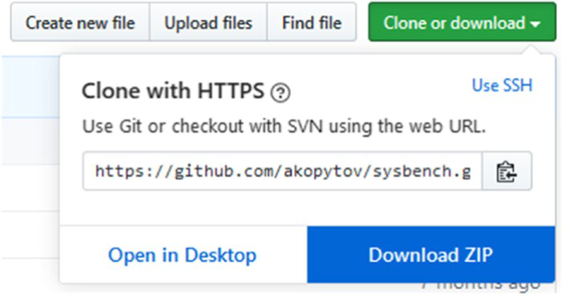

# 使用Sysbench进行基准测试

在将更改应用于生产系统之前，验证更改的影响非常重要。这适用于修改查询和大型更改（如重构应用程序和架构以及 MySQL 升级）等小更改。您可能认为最佳性能测试基于使用应用程序执行的相同查询的生产架构和数据。但是，它并不总是简单的，因为它听起来要重新创建正确的工作负载，所以有时有必要使用标准基准套件。

本章首先介绍执行基准测试时的一些最佳实践，以及对 MySQL 中使用的一些最常见的基准和工具的浏览。然后，将更详细地考虑最常用的基准Sysbench。

## 最佳实践

安装基准程序并执行它很容易。困难的部分是正确使用它。执行 MySQL 基准测试共享性能调优的一些概念，第一点也是最重要的一点是，您需要以"知情的方式"工作。这意味着您必须很好地了解您的工具，并清楚地定义测试的目标和成功标准。对于工具，您需要知道如何正确使用它们，因为使用默认参数执行它们可能不会生成所需的测试。

这与基准的目标联系在一起。您需要确定什么？例如，您可能希望验证更改某些配置变量的效果，在这种情况下，必须确保已设置测试，以便测试区域。请考虑一个选项，例如innodb_io_capacity InnoDB 写入的速度。如果您的基准测试是只读测试，innodb_io_capacity更改不会产生任何影响。在此上下文中，您还需要确保一次只更改一件事，并且只进行相对较小的更改，就像在更改生产系统时应该进行一样。否则，如果同时更改多个设置，则某些设置可能会对结果做出积极贡献，而另一些设置则具有相反性，但您无法确定要保留哪些更改以及哪些更改。如果做出较大更改，可能会超过最佳值，因此，即使还有改进的余地，您最终还是将更改终止。

在测试结束时读取结果时，您需要了解标位测量结果;否则，结果只是一个毫无意义的数字。这还包括定义在测试期间要调整的变量，对于一般的性能调整，保持变量数量限制非常重要，因此您可以轻松地确定每个变量的效果。为了使结果有效，您还必须确保测试是可重复的，也就是说，如果执行同一测试两次，则得到相同的结果。测试可重复的一个要求是，您具有定义的系统的起始状态。

------

**提示** 不要假定一个客户端足以生成您瞄准的负载。需要多少个客户端取决于并发查询的数量和要执行的基准。

------

这就引了下一个要点。基准应反映应用程序的工作负载。如果应用程序具有联机分析处理 （OLAP） 工作负载，或者如果应用程序写入量过大，则它可以帮助您使用联机事务处理 （OLTP） 基准来证明您的配置更改工作得非常有效。

您可能认为设计基准的最佳方法是捕获生产中执行的所有查询，并重播它们作为基准。这肯定有一些缺点，但也有挑战。收集执行的所有查询的成本很高，但是，如果您已经启用了 MySQL 企业审核日志以用于审核目的，可以使用该日志。将生产数据复制到测试系统也可能有数据隐私问题。最后，与当前生产负载相比，很难扩展测试以更改数据集的大小（无论是向下使其更易于管理还是可测试增长）。出于这些原因，通常有必要使用人工基准。

------

**提示** 您可以使用 MySQL 企业审核日志（需要订阅）或一般查询日志（非常高的开销）来捕获一段时间内的所有查询。这包括执行查询时的时间戳，因此您可以使用日志以相同的并发顺序重新播放查询。但是，您需要自己创建一个脚本来提取查询并执行它们。

------

下一点是关于与前一点相关的基准结果。当您获得基准测试结果时，了解结果的含义非常重要，并且不要仅仅因为结果看起来错误而放弃结果。阿苏克，基准结果是"永不错误";这是一些工作的结果。如果结果没有结果，那么了解结果为何会这样，是一点。也许，您没有使用您预期的参数或使用的参数大小与预期不同，但也可能有其他内容干扰基准，或者第三个参数。如果某样东西干扰了基准，那么在生产中是否也会发生这种事情？如果可以，那么基准非常相关，您需要决定在生产中如何处理此类情况。

要了解基准测试期间发生的情况，监视 MySQL 和主机系统也很重要。一种选择是使用与用于生产系统相同的监控解决方案。但是，测试或开发系统的基准测试与生产系统有点不同，因为您通常对高频采样不感兴趣，但在基准测试期间持续时间较短，因此使用专用的基准监控解决方案非常有用。其中一个选项dim_STAT由 DimitriKravtchuk 开发的 http://dimitrik.free.fr/（http://dimitrik.free.fr/），他是 MySQL 的性能架构师，并且是许多 MySQL 服务器基准测试的幕后黑手。

一般来说，了解结果不是一件简单的事情。还有一件事你需要注意的是，如果有一个临时摊位，在基准期间会发生什么。座标是保留后续查询，还是继续提交查询？如果保留，则后续查询实际上将比实际世界中的查询快，因为用户不会仅仅因为存在积压而停止提交请求。

最后，基准测试通常生成多个指标，因此您需要分析结果，因为它对您的系统最相关。例如，延迟还是直通输出是最重要的？或者你们对两者都有要求吗？还是你更对第三个指标更不感兴趣？

## 标准TPC基准

有一个几乎没完没了的基准列表，但最终那些通常使用的测试归结为少数的测试。这并不意味着您不应考虑其他基准;最后重要的是基准适用于您的要求。

最常用的标准基准由 TPC （www.tpc.org/） 定义，新的基准被设计为硬件和软件更改，使得老基准太简单。TPC网站包括基准的详细描述和规格。表3-1总结了当前的企业TPC基准。

| Name    | Type             | Description                                                  |
| ------- | ---------------- | ------------------------------------------------------------ |
| TPC-C   | OLTP             | 这也许是TPC基准中最经典的基准，其历史可以追溯到1992年。它模拟了批发供应商的查询，并使用了9个表格。 |
| TPC-DI  | Data Integration | 测试提取，转换和加载（ETL）工作负载                          |
| TPC-DS  | Decision Support | 该基准测试包括对数据仓库（星型架构）的复杂查询。             |
| TPC-DS  | OLTP             | 这意味着可以使用更复杂的架构和查询来代替TPC-C，因此对于现代数据库而言更现实。 它包括33个表。 |
| TPC-H   | Decision Support | 这是另一个经典基准测试，通常用于测试优化器功能。 它由22个复杂的查询组成，旨在模拟OLTP数据库的报告方。 |
| TPC-VMS | Virtualization   | 这使用TPC-C，TPC-DS，TPS-E和TPC-H基准来确定虚拟数据库的性能指标。 |

这些标准基准的优点是，您更有可能找到实现它们工具，并且可以与其他人员获得的结果进行比较。

------

**提示** 如果您想了解有关 TPC 基准以及如何以最佳方式执行数据库基准测试，请考虑 Bert Scalzo：数据库基准和压力测试 （Apress） www.apress.com/gp/book/9781484240076。

------

与有标准基准一样，也有一些通用的基准标记工具。

## 通用基准工具

实现基准远不是微不足道的，因此在大多数情况下，首选使用可执行基准测试的基准工具。有些工具是跨平台和/或可以使用几个不同的数据库系统，而其他工具则更具体。您应该选择实现所需的基准的基准，并处理您拥有生产系统的平台上。

表3-2总结了一些最常用的基准测试工具来测试MySQL的性能。

| Benchmark           | Description                                                  |
| ------------------- | ------------------------------------------------------------ |
| Sysbench            | 这是最常用的基准，本章将主要介绍该基准。 它具有针对OLTP工作负载的内置测试，非数据库测试（例如纯I / O，CPU和内存测试）等。 此外，最新版本支持自定义工作负载。 它是开源的，主要在Linux上使用。 可以从https://github.com/akopytov/sysbench下载。 |
| DBT2                | DBT2可用于使用订单系统（TPC-C）模拟OLTP工作负载。 DBT2也可用于自动化Sysbench，可从https：//dev.mysql获得。 com / downloads / benchmarks.html。 |
| DBT3                | DBT3实现TPC-H基准，并用于测试复杂查询的性能。 它是MySQL优化器开发人员在实施新的优化器功能后用来验证性能的最喜欢的测试之一。 可从https://sourceforge.net/projects/osdldbt/获得DBT3的副本。 |
| HammerDB            | HammerDB工具是一个免费的跨数据库工具，同时支持Microsoft Windows和Linux。 它支持TPC-C和TPC-H基准，可从https://hammerdb.com/获得。 |
| Database Factory    | Database Factory是用于Microsoft Windows的强大基准测试工具，它支持多个数据库和基准。 它支持TPC-H，TPC-C，TPC-D和TPC-E基准测试等等。 它是一种商业产品（可免费试用）：www.quest。 com / products / benchmark-factory /。 |
| iiBench             | iiBench正在测试将数据插入数据库的速度，因此如果您经常需要摄取大量数据，则iiBench很有用。 可以从https://github.com/tmcallaghan/iibench-mysql下载。 |
| DVD Store Version 3 | DVD商店将样本DVD商店的数据与基准进行合并。 它可以生成任何给定大小的数据，标准大小为10 MB，1 GB和100 GB。 它也可用作常规测试数据，可以从https：// github下载。 com / dvdstore / ds3。 它基于较旧的Dell DVD Store数据库测试套件。 |
| mysqlslap           | mysqlslap工具是特殊的，因为它随MySQL安装一起提供。 它可以用于针对您选择的表生成并发工作负载。 这是一个非常简单的工具，因此不能用于太多目的，但易于使用。 可以在https://dev.mysql.com/doc/refman/en/mysqlslap.html上找到mysqlslap的手册页。 |

MySQL最常用的工具是Sysbench，本章其余部分介绍其安装和示例用法。

## Sysbench安装

由于 Sysbench 是一个开源工具，因此有多个叉可用。MySQL 维护这些叉子之一;然而，为了得到最新的功能的版本，建议使用叉由阿列克谢·科皮托夫。（这也是 MySQL 性能架构师迪米特里·克拉夫丘克推荐的叉子。本章中的示例全部使用 Kopytov 的分叉版本 1.0.17（但请注意输出上列出的版本为 1.1.0），但其他 Sysbench 分叉的示例中示例将类似，只要分叉是新的，足以包含演示的功能。

有人支持使用本机 Linux 包安装 Sysbench，从 macOS 上的Homebrew开始，或者自己编译它。虽然使用本机包进行安装更简单，但通常最好自己编译，因为它可以确保您根据MySQL 8开发库进行编译，并且您可以在比有包更多的平台上编译 Sysbench。

------

**提示** 有关所有安装说明的详细信息，包括必需的独立性和使用本机包，请参阅https://github.com/akopytov/sysbench。在系统座 1.0 中，对微软 Windows 的支持已放弃。目前尚不得而知是否将重新引入支持。如果您使用的是 Microsoft Windows，建议通过 Linux （WSL） （https://msdn.microsoft.com/en-us/commandline/wsl/about） 的 Windows 子系统安装 Sysbench，在这种情况下，本章中的说明应稍作修改（具体取决于您选择的 Linux 发行版）。Analtern 是使用虚拟机，例如，在 VirtualBox 中。

------

编译软件可能不再很常见，但幸运的是，编译 Sysbench 是向前的。您需要下载源代码，然后配置生成、编译它，最后安装它。

在编译 Sysbench 之前，您需要安装一些工具。所需的工具取决于您的操作系统。有关详细信息，请参阅项目的 GitHub 页面上的安装说明。例如，在 Oracle Linux 7 上：

```
shell$ sudo yum install make automake libtool \
 pkgconfig libaio-devel \
 openssl-devel
```

您还需要安装 MySQL 8 开发库。在 Linux 上这样做的最简单方法是从计算机安装用于 Linux 分发的 MySQL https://dev.mysql.com/downloads/。清单 3-1 显示了在 Oracle Linux 7 上安装 MySQL 8 开发库的示例。

```
Listing 3-1. Installing the MySQL 8 development libraries
shell$ wget https://dev.mysql.com/get/mysql80-community-release-el7-3.
noarch.rpm
...
Saving to: 'mysql80-community-release-el7-3.noarch.rpm'
100%[=================>] 26,024 --.-K/s in 0.006s
2019-10-12 14:21:18 (4.37 MB/s) - 'mysql80-community-release-el7-3.noarch.
rpm' saved [26024/26024]
shell$ sudo yum install mysql80-community-release-el7-3.noarch.rpm
Loaded plugins: langpacks, ulninfo
Examining mysql80-community-release-el7-3.noarch.rpm: mysql80-communityrelease-el7-3.noarch
Marking mysql80-community-release-el7-3.noarch.rpm to be installed
Resolving Dependencies
--> Running transaction check
---> Package mysql80-community-release.noarch 0:el7-3 will be installed
--> Finished Dependency Resolution
Dependencies Resolved
===========================================================
 Package
 Arch Version
 Repository Size
===========================================================
Installing:
 mysql80-community-release
 noarch el7-3
 /mysql80-community-release-el7-3.noarch 31 k
Transaction Summary
===========================================================
Install 1 Package
Total size: 31 k
Installed size: 31 k
Is this ok [y/d/N]: y
Downloading packages:
Running transaction check
Running transaction test
Transaction test succeeded
Running transaction
 Installing : mysql80-community-release-el7-3.noarc 1/1
 Verifying : mysql80-community-release-el7-3.noarc 1/1
Installed:
 mysql80-community-release.noarch 0:el7-3
Complete!
shell$ sudo yum install mysql-devel
...
Dependencies Resolved
===========================================================
 Package Arch Version Repository Size
===========================================================
Installing:
 mysql-community-client
 x86_64 8.0.17-1.el7 mysql80-community 32 M
 replacing mariadb.x86_64 1:5.5.64-1.el7
 mysql-community-devel
 x86_64 8.0.17-1.el7 mysql80-community 5.5 M
 mysql-community-libs
 x86_64 8.0.17-1.el7 mysql80-community 3.0 M
 replacing mariadb-libs.x86_64 1:5.5.64-1.el7
 mysql-community-libs-compat
 x86_64 8.0.17-1.el7 mysql80-community 2.1 M
 replacing mariadb-libs.x86_64 1:5.5.64-1.el7
 mysql-community-server
 x86_64 8.0.17-1.el7 mysql80-community 415 M
 replacing mariadb-server.x86_64 1:5.5.64-1.el7
Installing for dependencies:
 mysql-community-common
 x86_64 8.0.17-1.el7 mysql80-community 589 k
Transaction Summary
===========================================================
Install 5 Packages (+1 Dependent package)
Total download size: 459 M
...
Complete!
```

输出取决于您已经安装的内容。 注意，如何将其他几个MySQL软件包（包括mysql-community-server）作为依赖项引入。 这是因为在这种情况下，mysql-community-devel软件包替换了另一个已存在的软件包，该软件包触发了一系列依赖关系更新。

------

**注意**：如果安装了旧版本的 MySQL 或分叉，则将升级所有相关包。因此，最好在主机上编译 Sysbench，您可以在其中自由替换包或已安装正确的 MySQL 8 开发库。

------

您现在已准备好考虑 Sysbench 本身。您可以选择克隆GitHub存储库或下载源作为ZIP文件。要克隆存储库，您需要安装 git，然后使用 git 克隆命令：

```
shell$ git clone https://github.com/akopytov/sysbench.git
Cloning into 'sysbench'...
remote: Enumerating objects: 14, done.
remote: Counting objects: 100% (14/14), done.
remote: Compressing objects: 100% (12/12), done.
remote: Total 9740 (delta 4), reused 5 (delta 2), pack-reused 9726
Receiving objects: 100% (9740/9740), 4.12 MiB | 2.12 MiB/s, done.
Resolving deltas: 100% (6958/6958), done.
```

带有源代码的ZIP文件可以从GitHub存储库下载，例如，使用wget：

```
shell$ wget https://github.com/akopytov/sysbench/archive/master.zip
...
Connecting to codeload.github.com (codeload.github.
com)|52.63.100.255|:443... connected.
HTTP request sent, awaiting response... 200 OK
Length: unspecified [application/zip]
Saving to: 'master.zip'
 [ <=> ] 2,282,636 3.48MB/s in 0.6s
2019-10-12 16:01:33 (3.48 MB/s) - 'master.zip' saved [2282636]
```

或者，您可以使用浏览器下载ZIP文件，如图3-1所示。



单击下载ZIP，文件将下载。 下载源代码后，将其解压缩。

现在您可以配置编译了。 输入带有源代码的顶级目录。 目录清单应类似于以下输出：

```
shell$ ls
autogen.sh COPYING Makefile.am rpm tests
ChangeLog debian missing scripts third_party
config install-sh mkinstalldirs snap
configure.ac m4 README.md src
```

使用autogen.sh脚本和配置命令完成配置，如清单3-2所示。

```
Listing 3-2. Configuring Sysbench for compilation and installation
shell$ ./autogen.sh
autoreconf: Entering directory `.'
...
parallel-tests: installing 'config/test-driver'
autoreconf: Leaving directory `.'
shell$ ./configure
checking build system type... x86_64-unknown-linux-gnu
checking host system type... x86_64-unknown-linux-gnu
...
===========================================================================
sysbench version : 1.1.0-74f3b6b
CC : gcc -std=gnu99
CFLAGS : -O3 -funroll-loops -ggdb3 -march=core2 -Wall -Wextra
-Wpointer-arith -Wbad-function-cast -Wstrictprototypes -Wnested-externs -Wno-format-zero-length
-Wundef -Wstrict-prototypes -Wmissing-prototypes
-Wmissing-declarations -Wredundant-decls -Wcast-align
-Wvla -pthread
CPPFLAGS : -D_GNU_SOURCE -I$(top_srcdir)/src -I$(abs_top_
builddir)/third_party/luajit/inc -I$(abs_top_
builddir)/third_party/concurrency_kit/include
LDFLAGS : -L/usr/local/lib
LIBS : -laio -lm
prefix : /usr/local
bindir : ${prefix}/bin
libexecdir : ${prefix}/libexec
mandir : ${prefix}/share/man
datadir : ${prefix}/share
MySQL support : yes
PostgreSQL support : no
LuaJIT : bundled
LUAJIT_CFLAGS : -I$(abs_top_builddir)/third_party/luajit/inc
LUAJIT_LIBS : $(abs_top_builddir)/third_party/luajit/lib/libluajit5.1.a -ldl
LUAJIT_LDFLAGS : -rdynamic
Concurrency Kit : bundled
CK_CFLAGS : -I$(abs_top_builddir)/third_party/concurrency_kit/
include
CK_LIBS : $(abs_top_builddir)/third_party/concurrency_kit/lib/
libck.a
configure flags :
===========================================================================
```

配置的结尾显示了将用于编译的选项。 确保MySQL支持说是。 默认为安装在/usr /local中。 您可以在执行configure时使用--prefix选项更改它，例如，./configure --prefix=/home/myuser/sysbench。

下一步是编译使用make命令完成的代码：

```
shell$ make -j
Making all in third_party/luajit
...
make[1]: Nothing to be done for `all-am'.
make[1]: Leaving directory `/home/myuser/git/sysbench'
```

-j选项告诉make并行编译源代码，这可以减少编译时间。 但是，Sysbench在所有情况下都可以快速编译，因此在这种情况下它并不是很重要。

最后一步是安装Sysbench的编译版本：

```
shell$ sudo make install
Making install in third_party/luajit
...
make[2]: Leaving directory `/home/myuser/git/sysbench'
make[1]: Leaving directory `/home/myuser/git/sysbench'
```

这就对了。 现在您可以使用Sysbench执行基准测试了


## 执行基准

Sysbench包括几个可供使用的基准。 范围从非数据库内置测试到各种数据库测试。 由于非数据库测试是在Sysbench源代码本身中定义的，因此被认为是内置的。 其他测试在Lua脚本中定义，并安装在/usr/local/share/sysbench/目录中（假定您安装在默认位置）。

------

**注意** 本节和下一节假定您有一个MySQL实例可用于在与安装Sysbench相同的主机上进行测试。 如果不是这种情况，则需要根据需要调整主机名。

------

您可以通过使用--help参数调用sysbench来获得了解Sysbench参数的一般帮助：

```
shell$ sysbench –help
...
Compiled-in tests:
 fileio - File I/O test
 cpu - CPU performance test
 memory - Memory functions speed test
 threads - Threads subsystem performance test
 mutex - Mutex performance test
```

有关每个测试的选项列表，请参阅"系统座 <testname> 帮助"。

输出底部是内置测试的列表，以及有关如何获取有关给定测试更多信息的提示。您可以通过在共享目录中列出来获取其他测试的列表：

```
shell$ ls /usr/local/share/sysbench/
bulk_insert.lua oltp_update_index.lua
oltp_common.lua oltp_update_non_index.lua
oltp_delete.lua oltp_write_only.lua
oltp_insert.lua select_random_points.lua
oltp_point_select.lua select_random_ranges.lua
oltp_read_only.lua tests
oltp_read_write.lua
```

除了 ）之外，具有 .lua 扩展名的文件是可用的测试。Lua 语言是一种轻量级编程语言，通常用于将代码嵌入到程序中。使用 Lua 程序类似于使用脚本语言（如 Python），但代码是通过另一个程序执行的（本例中为 Sysbench）。

如前所述，您可以通过提供测试的名称和帮助命令来获取有关测试的其他。例如，若要获取有关中定义的测试的其他信息，命令，如清单。

```
shell$ sysbench oltp_read_only help
sysbench 1.1.0-74f3b6b (using bundled LuaJIT 2.1.0-beta3)
oltp_read_only options:
 --auto_inc[=on|off] Use AUTO_INCREMENT column as Primary Key
(for MySQL), or its alternatives in other
DBMS. When disabled, use client-generated
IDs [on]
 --create_secondary[=on|off] Create a secondary index in addition to the
PRIMARY KEY [on]
 --create_table_options=STRING Extra CREATE TABLE options []
1
www.lua.org/ and https://en.wikipedia.org/wiki/Lua_(programming_language)
 --delete_inserts=N Number of DELETE/INSERT combinations per
transaction [1]
 --distinct_ranges=N Number of SELECT DISTINCT queries per
transaction [1]
 --index_updates=N Number of UPDATE index queries per
transaction [1]
 --mysql_storage_engine=STRING Storage engine, if MySQL is used [innodb]
 --non_index_updates=N Number of UPDATE non-index queries per
transaction [1]
 --order_ranges=N Number of SELECT ORDER BY queries per
transaction [1]
 --pgsql_variant=STRING Use this PostgreSQL variant when running
with the PostgreSQL driver. The only
currently supported variant is 'redshift'.
When enabled, create_secondary is
automatically disabled, and delete_inserts
is set to 0
 --point_selects=N Number of point SELECT queries per
transaction [10]
 --range_selects[=on|off] Enable/disable all range SELECT queries [on]
 --range_size=N Range size for range SELECT queries [100]
 --reconnect=N Reconnect after every N events. The default
(0) is to not reconnect [0]
 --secondary[=on|off] Use a secondary index in place of the
PRIMARY KEY [off]
 --simple_ranges=N Number of simple range SELECT queries per
transaction [1]
 --skip_trx[=on|off] Don't start explicit transactions and execute
all queries in the AUTOCOMMIT mode [off]
 --sum_ranges=N Number of SELECT SUM() queries per
transaction [1]
 --table_size=N Number of rows per table [10000]
 --tables=N Number of tables [1]
```


方括号中的值是默认值。

帮助只是几个可用命令之一（某些测试可能无法实现所有命令）。其他涵盖基准测试的各个阶段：

- ：执行设置测试所需的步骤，例如，通过创建和填充测试所需的表。
- 确保缓冲区和缓存是温暖的，例如，表数据和索引已加载到 InnoDB 缓冲池中。这对于 OLTP 基准来说很特别。
- 执行测试本身。此命令由所有测试提供。
- 测试使用的任何表。

例如，请考虑以前检索到的帮助的只读 OLTP 测试。首先，创建一个可以执行所需查询的 MySQL 用户。默认值是使用架构，因此一个简单的解决方案是创建具有此架构上所有权限的用户：

```
mysql> CREATE USER sbtest@localhost IDENTIFIED BY 'password';
Query OK, 0 rows affected (0.02 sec)
mysql> GRANT ALL ON sbtest.* TO sbtest@localhost;
Query OK, 0 rows affected (0.01 sec)
mysql> CREATE SCHEMA sbtest;
Query OK, 1 row affected (0.01 sec)
```

在这种情况下，用户应从本地主机。通常情况并非如此，因此您需要更改帐户的主机名部分，以反映 Sysbench 用户的连接来源。用户名被选为因为这是 Sysbench 使用的默认值。架构也是创建时创建的，因为 Sysbench 测试要求它在第一次连接时。

如果要执行一个基准测试，该基准值使用四个表，每个表包含 20000您可以像清单中所示那样准备该测试。

```
Listing 3-4. Preparing the test
shell$ sysbench oltp_read_only \
 --mysql-host=127.0.0.1 \
 --mysql-port=3306 \
 --mysql-user=sbtest \
 --mysql-password=password \
 --mysql-ssl=REQUIRED \
 --mysql-db=sbtest \
 --table_size=20000 \
 --tables=4 \
 --threads=4 \
 prepare
sysbench 1.1.0-74f3b6b (using bundled LuaJIT 2.1.0-beta3)
Initializing worker threads...
Creating table 'sbtest1'...
Creating table 'sbtest3'...
Creating table 'sbtest4'...
Creating table 'sbtest2'...
Inserting 20000 records into 'sbtest2'
Inserting 20000 records into 'sbtest3'
Inserting 20000 records into 'sbtest1'
Inserting 20000 records into 'sbtest4'
Creating a secondary index on 'sbtest3'...
Creating a secondary index on 'sbtest2'...
Creating a secondary index on 'sbtest4'...
Creating a secondary index on 'sbtest1'...
```

这将使用四个线程将创建为 在这种情况下，准备步骤将很快，因为表很小;但是，如果使用大型表执行基准测试，则设置测试可能需要大量时间。由于基准测试通常涉及执行一系列测试，因此可以通过创建二进制备份（复制表（使用 MySQL 关闭或使用 MySQL 企业备份等工具）或文件系统快照来加快测试速度。对于每个后续测试，您可以还原备份，而不是重新创建表。

可选地，您可以作为下一步经历预热如清单。

```
Listing 3-5. Warming MySQL up for the test
shell$ sysbench oltp_read_only \
 --mysql-host=127.0.0.1 \
 --mysql-port=3306 \
 --mysql-user=sbtest \
 --mysql-password=password \
 --mysql-ssl=REQUIRED \
 --mysql-db=sbtest \
 --table_size=20000 \
 --tables=4 \
 --threads=4 \
 warmup
sysbench 1.1.0-74f3b6b (using bundled LuaJIT 2.1.0-beta3)
Initializing worker threads...
Preloading table sbtest3
Preloading table sbtest1
Preloading table sbtest2
Preloading table sbtest4
```


在这里，必须包括 ，否则将仅预加载表的默认行数 （10，000）。预加载包括平均 id 列个简单的 SELECT 查询，这些查询在子查询中获取的行（查询已重新格式化）：

```sql
SELECT AVG(id)
 FROM (SELECT *
 FROM sbtest1 FORCE KEY (PRIMARY)
 LIMIT 20000
 ) t
SELECT COUNT(*)
 FROM (SELECT *
 FROM sbtest1
 WHERE k LIKE '%0%'
 LIMIT 20000
 ) t
```


因此，预热阶段可能不等于运行实际基准在一段时间。

基准测试本身正在使用 run命令执行。有两个选项可以指定测试的持续时间：

- ：要执行的最大事件数。默认值为 0。
- 最长持续时间（以秒为单位）。默认值为 10。

当其中一个选项的值为 0 时，它表示无限。因此，如果同时将和设置为 0，则测试将永远运行。例如，如果您对基准统计信息本身不感兴趣，但希望收集监视指标，或者希望在执行其他任务时创建工作负荷，这非常有用。

例如，如果要执行测试一分钟（60 秒），可以使用像清单。

```
Listing 3-6. Executing a Sysbench test for one minute
shell$ sysbench oltp_read_only \
 --mysql-host=127.0.0.1 \
 --mysql-port=3306 \
 --mysql-user=sbtest \
 --mysql-password=password \
 --mysql-ssl=REQUIRED \
 --mysql-db=sbtest \
 --table_size=20000 \
 --tables=4 \
 --time=60 \
 --threads=8 \
 run
sysbench 1.1.0-74f3b6b (using bundled LuaJIT 2.1.0-beta3)
Running the test with following options:
Number of threads: 8
Initializing random number generator from current time
Initializing worker threads...
Threads started!
SQL statistics:
 queries performed:
 read: 766682
 write: 0
 other: 109526
 total: 876208
 transactions: 54763 (912.52 per sec.)
 queries: 876208 (14600.36 per sec.)
 ignored errors: 0 (0.00 per sec.)
 reconnects: 0 (0.00 per sec.)
Throughput:
 events/s (eps): 912.5224
 time elapsed: 60.0128s
 total number of events: 54763
Latency (ms):
 min: 3.26
 avg: 8.76
 max: 122.43
 95th percentile: 11.24
 sum: 479591.29
Threads fairness:
 events (avg/stddev): 6845.3750/70.14
 execution time (avg/stddev): 59.9489/0.00
```


请注意，与准备和预热阶段不同使用八个线程运行。线程数通常是一系列测试中变化的线程数之一，用于确定系统可以维持的并发工作负载。有必要指定 run 命令应使用的表，否则将使用默认值（Sysbench 命令之间没有共享状态）。

完成测试后，可以使用清单中所示的告诉 Sysbench 在自身进行清理。

```
shell$ sysbench oltp_read_only \
 --mysql-host=127.0.0.1 \
 --mysql-port=3306 \
 --mysql-user=sbtest \
 --mysql-password=password \
 --mysql-ssl=REQUIRED \
 --mysql-db=sbtest \
 --tables=4 \
 cleanup
sysbench 1.1.0-74f3b6b (using bundled LuaJIT 2.1.0-beta3)
Dropping table 'sbtest1'...
Dropping table 'sbtest2'...
Dropping table 'sbtest3'...
Dropping table 'sbtest4'...
```


请注意，必须指定表数;否则，将仅删除第一个表。

内置测试很棒，但让 Sysbench 成为真正强大的工具的是，您还可以定义自己的基准。

## 创建自定义基准

如上一节所示，Sysbench 中包含的数据库测试在 Lua 脚本 （www.lua.org/）。这意味着定义自己的测试所需的所有操作都是创建一个包含测试定义的 Lua 脚本，并保存在 Sysbench 的共享目录中。一个有用的示例是，如果您想要基于应用程序的特定要求创建测试，以测试索引的效果、重构应用程序或类似项。

本节将编写一个小示例测试脚本，以便查看创建自己的测试的原则。测试也可以按顺序在GitHub 存储库中按顺序找到。

### 自定义脚本概述

示例基准测试将测试通过表中每个序列具有一行实现序列的性能。此类构造有时用于在应用程序中实现自定义序列。定义和表使用示例见清单。

```
mysql> SHOW CREATE TABLE sbtest.sbtest1\G
*************************** 1. row ***************************
 Table: sbtest1
Create Table: CREATE TABLE `sbtest1` (
 `id` varchar(10) NOT NULL,
 `val` bigint(20) unsigned NOT NULL DEFAULT '0',
 PRIMARY KEY (`id`)
) ENGINE=InnoDB DEFAULT CHARSET=utf8mb4 COLLATE=utf8mb4_0900_ai_ci
1 row in set (0.00 sec)
mysql> SELECT * FROM sbtest.sbtest1;
+--------+-----+
| id     | val |
+--------+-----+
| sbkey1 | 0   |
+--------+-----+
1 row in set (0.00 sec)

mysql> UPDATE sbtest1
 SET val = LAST_INSERT_ID(val+1)
 WHERE id = 'sbkey1';
Query OK, 1 row affected (0.01 sec)
Rows matched: 1 Changed: 1 Warnings: 0
mysql> SELECT LAST_INSERT_ID();
+------------------+
| LAST_INSERT_ID() |
+------------------+
| 1                |
+------------------+
1 row in set (0.00 sec)
mysql> SELECT * FROM sbtest.sbtest1;
+--------+-----+
| id     | val |
+--------+-----+
| sbkey1 | 1   |
+--------+-----+
1 row in set (0.00 sec)
```


UPDATE 函数用于为插入的 ID 分配会话值，因此可以在 SELECT 语句中该函数。

示例测试将具有以下功能：

- 支持准备和命令。
- 和命令可以并行执行。
- 支持指定表数、表大小以及是否使用显式事务。
- 验证每个的行数在 1~99999 范围内。表列创建为并且键前缀为，因此最多只能有五位数字。


"准备"、"运行"和"清理"组表示命令，"帮助程序"组包含将从多个命令中使用的两个帮助程序函数。运行是特殊的，因为它们始终存在。根据脚本添加的选项自动生成帮助，因此无需特别考虑。还有一些代码是外部函数，其中第一个代码是理智检查和脚本将支持的选项。

### 定义选项

添加到的选项。这是 Sysbench 的内置功能之一，可用于脚本。另一，它是为执行提供的命令的名称。

清单显示了如何验证是否已设置命令，然后添加此脚本支持的三个选项。

```
Listing 3-9. Verifying a command is specified and adding the options
-- Validate that a command was provided
if sysbench.cmdline.command == nil then
 error("Command is required. Supported commands: " ..
 "prepare, run, cleanup, help")
end
-- Specify the supported options for this test
sysbench.cmdline.options = {
 skip_trx = {"Don't start explicit transactions and " ..
 "execute all queries in the AUTOCOMMIT mode",
 false},
 table_size = {"The number of rows per table. Supported " ..
 "values: 1-99999", 1},
 tables = {"The number of tables", 1}
}
```


如果未设置函数用于发出包含受支持命令列表的错误消息。没有必要验证该命令是否是受支持的命令之一，因为 Sysbench 将自动验证该命令。

这些选项使用由帮助文本和默认值组成的数组添加。使用此脚本中的定义，生成的帮助文本变为：

```
shell$ sysbench sequence help
sysbench 1.1.0-74f3b6b (using bundled LuaJIT 2.1.0-beta3)
sequence options
 --skip_trx[=on|off] Don't start explicit transactions and execute all
queries in the AUTOCOMMIT mode [off]
 --table_size=N The number of rows per table. Supported values:
1-99999 [1]
 --tables=N The number of tables [1]
```


选项在可用，例如，若要获取测试中的表数，可以使用。哈希值全局可用，因此在使用它之前无需做任何事情。

现在，您可以实现脚本支持的三个命令。由于是必填项，因此它是将讨论的第一个命令。

### 运行命令

run是特殊的，因为它是必需的，并且它始终支持并行执行。与在单个函数中实现的其他命令（可选地调用其他函数）不同，Sysbench 使用三个函数来命令。必须始终存在的三个函数是

- 当 Sysbench 初始化脚本时，将调用此代码。
- 当 Sysbench 完成脚本执行时，将调用此代码。
- 这是实际测试的实现，每次迭代调用一次。

对于此示例函数可以非常简单：

```
-- Initialize the script
-- Initialize the global variables used in the rest of the script
function thread_init()
 -- Initialize the database driver and connections
 db = sysbench.sql.driver()
 cnx = db:connect()
end
```


对于此简单测试，所需的所有初始化都是创建到 MySQL 的连接，该连接包括初始化数据库驱动程序，并用它来创建连接。驱动程序可从。通过创建在函数中的连接，Sysbench 可以重用连接，而不是为每次迭代创建新连接。如果要模拟为每组查询创建新连接，还可以选择通过添加并将连接对象作为本地，就像稍后准备和清理命令时一。

同样函数在执行后进行清理：

```
-- Clean up after the test
function thread_done()
 -- Close the connection to the database
 cnx:disconnect()
end
```


在这种情况下，所有需要关闭使用连接的断开连接完成的连接。

三个必需函数中最有趣的是函数，它定义执行测试时执行什么。示例脚本的代码见清单。

```
Listing 3-10. The event() function
-- Called for each iteration
function event()
 -- Check the --skip_trx option which determines
 -- whether explicit transactions are required.
 if not sysbench.opt.skip_trx then
 cnx:query("BEGIN")
 end
 -- Execute the customer test
 do_increment()
 -- If necessary, commit the transaction
 if not sysbench.opt.skip_trx then
 cnx:query("COMMIT")
 end
end
```


此代码使用一个选项选项。如果则测试依赖于自动提交功能;如果禁用了 -，则测试依赖于自动提交功能。如果禁用该系统，则测试将依赖于自动提交功能。如果 --，则测试将依赖于自动提交功能。如果 --，则测试将依赖于自动提交功能。如果否则，将 COMMIT。

在这种情况下，事件实际上不执行任何工作本身。这被推迟到函数，以显示如何添加额外的函数来像在其他程序中那样分离工作。清单函数和几个帮助器函数一起显示在清单。

```
Listing 3-11. The do_increment() and helper functions
-- Generate the table name from the table number
function gen_table_name(table_num)
 return string.format("sbtest%d", table_num)
end
-- Generate the key from an id
function gen_key(id)
 return string.format("sbkey%d", id)
end
-- Increment the counter and fetch the new value
function do_increment()
 -- Choose a random table and id
 -- among the tables and rows available
 table_num = math.random(sysbench.opt.tables)
 table_name = gen_table_name(table_num)
 id = math.random(sysbench.opt.table_size)
 key = gen_key(id)
 query = string.format([[
UPDATE %s
 SET val = LAST_INSERT_ID(val+1)
 WHERE id = '%s']], table_name, key)
 cnx:query(query)
 cnx:query("SELECT LAST_INSERT_ID()")
end
```

函数基于整数生成表名函数同样基于整数 id 生成键值。表名和键值用于脚本中的其他几个位置，因此通过将逻辑拆分为帮助函数，可以确保在整个脚本中以相同方式生成它们。

函数本身开始基于基于表数和测试中每个表中的行数的随机值生成表名和键。在实际应用程序中，您可能没有对序列的这种统一访问，在这种情况下，您可以修改脚本中的逻辑。最后， 语句。脚本的可能扩展是在其他查询中使用生成的序列号，但请注意，您最终不会执行与尝试基准测试的内容不相关的工作。

这就是运行命令请注意，没有执行任何操作来实现并行执行;由 Sysbench 自动处理，除非您不想将所有线程视为相同。线程不应执行相同工作的一个示例是，其中每个线程将负责其自己的表。

### 准备命令

准备是支持并行执行的自定义命令的示例。命令的顶级代码在函数中实现，该函数反过来使用函数基于传递给函数的表号创建一个特定表。这两个函数可以在清单。

```
Listing 3-12. The do_prepare() and create_table() functions
-- Prepare the table
-- Can be parallelized up to the number of tables
function do_prepare()
 -- The script only supports up to 99999 rows
 -- as the id column is a varchar(10) and five
 -- characters is used by 'sbkey'
 assert(sysbench.opt.table_size > 0 and
 sysbench.opt.table_size < 100000,
 "Only 1-99999 rows per table is supported.")
 -- Initialize the database driver and connection
 local db = sysbench.sql.driver()
 local cnx = db:connect()
 -- Create table based on thread id
 for i = sysbench.tid % sysbench.opt.threads + 1,
 sysbench.opt.tables,
 sysbench.opt.threads do
 create_table(cnx, i)
 end
 -- Disconnect
 cnx:disconnect()
end
-- Create the Nth table
function create_table(cnx, table_num)
 table_name = gen_table_name(table_num)
 print(string.format(
 "Creating table '%s'...", table_name))
 -- Drop the table if it exists
 query = string.format(
 "DROP TABLE IF EXISTS %s", table_name)
 cnx:query(query)
 -- Create the new table
 query = string.format([[
CREATE TABLE %s (
 id varchar(10) NOT NULL,
 val bigint unsigned NOT NULL DEFAULT 0,
 PRIMARY KEY (id)
)]], table_name)
 cnx:query(query)
 -- Insert the rows inside a transaction
 cnx:query("BEGIN")
 for i = 1, sysbench.opt.table_size, 1 do
 query = string.format([[
INSERT INTO %s (id)
VALUES ('%s')]], table_name, gen_key(i))
 cnx:query(query)
 end
 cnx:query("COMMIT")
end
```


在的第一件事是验证行数是否在 1-99999 范围内。这是使用断言其中第一个参数必须计算为 true;否则，打印第二个输出时给出的错误消息，并且脚本存在。

每个因此将为你处理并行化（在示例末尾将对此进行更多操作），但您需要确保每个表只创建一次。这是通过 for 循环，线程 ID）的模数与线程数用于确定每个线程处理的表号。

实际表在中执行，以分离任务，以便更轻松地维护脚本。如果表已存在，则删除该表，然后创建该表，最后使用请求的行数填充表。所有行都插入到单个事务中，以提高性能。如果需要填充较大的表，则值得在每几千行之后进行提交，但由于此表中的最大行数为 99999，并且行非常小，因此可以保持简单，只需使用每个表的单个事务。

### 清理命令

必须实现的最后一个命令清理，这是单线程命令的示例。命令的工作在清理如清单。

```
Listing 3-13. The cleanup() function
-- Cleanup after the test
function cleanup()
 -- Initialize the database driver and connection
 local db = sysbench.sql.driver()
 local cnx = db:connect()
 -- Drop each table
 for i = 1, sysbench.opt.tables, 1 do
 table_name = gen_table_name(i)
 print(string.format(
 "Dropping table '%s' ...", table_name))
 query = string.format(
 "DROP TABLE IF EXISTS %s", table_name)
 cnx:query(query)
 end
 -- Disconnect
 cnx:disconnect()
end
```


清理仅支持串行执行，因此它只需循环遍历表，然后一个删除它们。

这留下了一个问题：Sysbench 如何命令可以并行运行，但清理不能运行？

### 注册命令

默认情况下，除运行之外所有命令均以串行执行，实现该命令的函数与命令命名相同。因此，对于，有必要将脚本中的对象设置为指向函数，并附加参数每个线程调用一次：

```
-- Specify the actions other than run that support
-- execution in parallel.
-- (Other supported actions are found based on the
-- function name except 'help' that is built-in.)
sysbench.cmdline.commands = {
 prepare = {do_prepare, sysbench.cmdline.PARALLEL_COMMAND}
}
```


sysbench.cmdline.PARALLEL_COMMAND数是内置的，并指定应并行执行命令。此代码在定义否则将分配零值。实际上，在脚本末尾添加代码很方便。

脚本到此结束。现在，只要已将其复制到共享的 Sysbench 目录与默认安装目录一起编译 Sysbench 时，就可以以与 Sysbench 一起提供的测试相同的方式使用它。假设您已将脚本保存为则清单中显示了脚本的使用示例（无输出）。

```
Listing 3-14. Example commands for the sequence test
shell$ sysbench sequence \
 --mysql-host=127.0.0.1 \
 --mysql-port=3306 \
 --mysql-user=sbtest \
 --mysql-password=password \
 --mysql-ssl=REQUIRED \
 --mysql-db=sbtest \
 --table_size=10 \
 --tables=4 \
 --threads=4 \
 prepare
shell$ sysbench sequence \
 --mysql-host=127.0.0.1 \
 --mysql-port=3306 \
 --mysql-user=sbtest \
 --mysql-password=password \
 --mysql-ssl=REQUIRED \
 --mysql-db=sbtest \
 --table_size=10 \
 --tables=4 \
 --time=60 \
 --threads=8 \
 run
shell$ sysbench sequence \
 --mysql-host=127.0.0.1 \
 --mysql-port=3306 \
 --mysql-user=sbtest \
 --mysql-password=password \
 --mysql-ssl=REQUIRED \
 --mysql-db=sbtest \
 --tables=4 \
 cleanup
```


请注意，在执行准备命令之前，必须存在它作为练习留给读者来尝试具有不同值的

## 总结

本章讨论了如何使用 MySQL 使用基准。首先，讨论了使用基准的一些一般最佳做法。最重要的一点就是，您已经确定了基准，哪些被认为是成功标准。这与一般的性能调优并不大。了解基准执行的测试以及结果的含义也很重要。通常，您需要通过正常监视解决方案或专用脚本收集其他指标，以确定基准是否成功。

接下来，涵盖了标准的TPC基准。TPC-C 和 TPC-E 基准测试 OLTP 工作负载，其中 TPC-C 使用最旧，但 TPC-E 是现代应用最现实的基准。TPC-H 和 TPC-DS 使用可能非常复杂的查询，例如，可以探索可能影响查询计划的更改。

虽然您可以选择自己从头开始实现基准测试，但更有可能使用预先存在的基准工具。MySQL 最常用的工具是 Sysbench，它详细介绍了这一点。首先，通过编译系统台安装了系统台。然后展示了如何执行标准 Sysbench 基准。然而，Sysbench 的真正优势在于您可以定义自己的自定义测试。最后一节显示了一个简单的示例。

与并不总是可以使用真实世界基准一样，也并不总是可以使用读取世界数据进行常规测试。下一章将探讨一些经常与 MySQL 一起使用的通用数据集，其中几个数据集也用于本书中。
