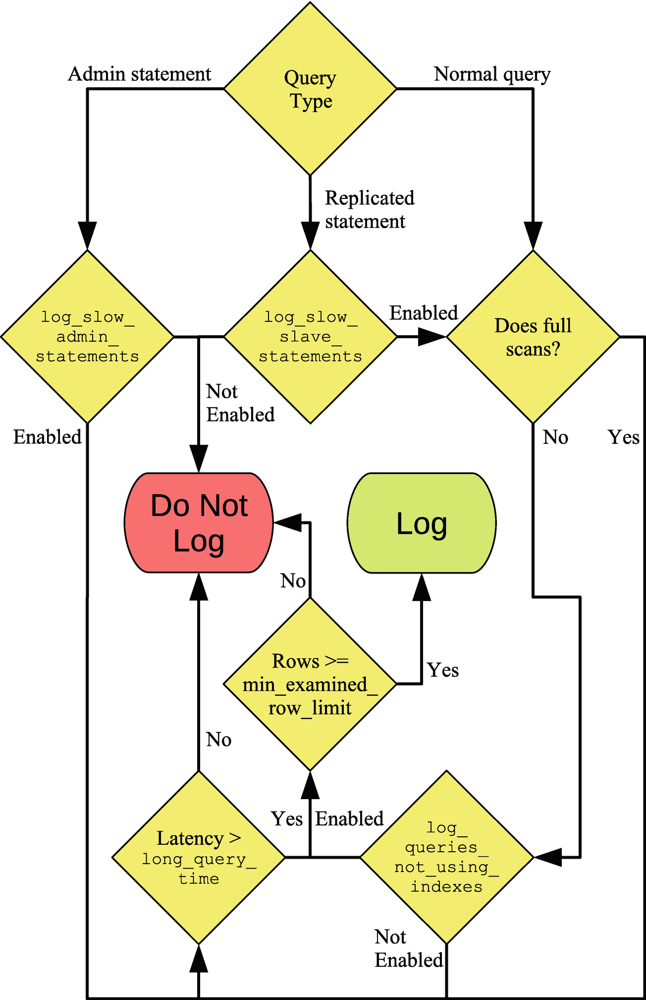

# 慢查询日志

在从Performance Schema获取查询统计信息之前的日子里，慢查询日志是查找最适合优化查询的主要信息来源。即使在今天，慢查询日志也不应该被完全消除。

与Performance Schema中的语句摘要信息相比，慢查询日志具有三个主要优点。记录的查询将保持不变，因此您可以在MySQL重新启动，使用时间戳记录查询以及记录实际查询后查看信息。 由于这些原因，慢查询日志通常与Performance Schema一起使用。

------

**提示** 像 MySQL 企业监视器 （https://dev.mysql.com/doc/mysql-monitor/en/mem-qanal-using.html） 这样的监视解决方案可以克服Performance Schema的这些限制，因此，如果您有包含详细查询信息的监控解决方案，则不太可能调低查询日志的速度。

------

慢查询日志也有缺点。开销高于Performance Schema，因为查询写入纯文本文件，并且编写事件时没有并发支持。查询日志的支持也有限（您可以将慢查询日志存储在表中，但这有其自身的缺点），这使得在调查期间使用它不太实用。

本章将介绍如何配置慢查询日志、原始日志事件的外观，以及如何使用 mysqldumpslow （mysqldumpslow.pl 在 Microsoft Windows） 脚本来聚合日志

## 配置

有几个选项可用于配置慢查询日志和记录哪些查询。启用日志的开销随着您日志的查询数而增加，配置良好的慢速查询日志非常重要。对查询进行"正确"的日志记录也便于识别感兴趣的查询。

默认情况下，不会启用慢查询日志，并且启用日志时，默认只是记录直接在本地实例上执行的非管理查询，并且查询需要 10 秒以上才能执行。表 9-1 总结了用于微调此行为的配置选项。该信息包括默认值以及该选项是否在全局范围或会话范围中使用，或者两者同时使用。选项按字母顺序列出。

| 选项/默认值/范围 | 描述 |
| ---------------- | ---- |
|                  |      |
|                  |      |
|                  |      |
|                  |      |
|                  |      |
|                  |      |
|                  |      |
|                  |      |
|                  |      |
|                  |      |
|                  |      |
|                  |      |

建议将事件log_output默认值，然后按"slow_query_log_file"将事件slow_query_log_file。将慢速查询日志作为表获取可能看起来很有吸引力;但是，在这种情况下，数据被保存为逗号分隔值 （CSV），并且与表相对应的查询无法使用索引。还有一些功能，如log_slow_extra，不支持log_output + 表。

这些选项意味着您可以对记录哪些查询进行细粒度的控制。除其他log_short_format所有选项都可以动态更改，因此您可以根据情况进行更改。如果您觉得很难确定选项如何中断，则图 9-1 显示了确定是否应记录查询的决策过程的流程图。（流程图仅说明性 – 实际代码路径不同。



流从查询类型开始。对于管理语句和复制语句，它们仅在启用相应选项时才继续。常规查询首先检查它们是否有资格不使用索引，然后回退检查查询执行时间（延迟）。如果满足任一条件，则检查是否检查了足够的行。一些更精细的细节，如不使用索引的语句的节限制，将不从图中算出。

有了所需的查询设置后，您需要查看日志中的事件以确定是否需要关注任何查询。

## Log Events

慢查询日志以纯文本形式构建事件。这意味着您可以使用任何喜欢检查该文件的文本查看器。在 Linux 和 Unix 上，较少的命令是一个很好的选项，因为它对处理大型文件具有很好的支持。在 Microsoft Windows 上，记事本® 是一种常见的选择，但对大型文件的支持并不相同。Windows 上的另一个建议是安装 Linux （WSL） 的 Windows 子系统，它允许您安装 Linux 发行版，并这样，可以访问命令，就像更少。

件的格式取决于设置。清单 9-1 显示了一个默认格式的 aevent 示例，long_query_time = 0 来记录所有查询。请注意，由于页面宽度有限，某些行已换行。

```
Listing 9-1. A slow query log event in the default format
# Time: 2019-09-17T09:37:53.269881Z
# User@Host: root[root] @ localhost [::1] Id: 22
# Query_time: 0.032531 Lock_time: 0.000221 Rows_sent: 10 Rows_examined: 4089
SET timestamp=1568713073;
SELECT CountryCode, COUNT(*) FROM world.city GROUP BY CountryCode ORDER BY
COUNT(*) DESC LIMIT 10;
```

第一行显示执行查询时。这是您可以控制 UTC 或系统时间是否与"系统"选项一起log_timestamp戳。第二行显示哪个帐户执行了查询和连接 ID。第三行包括查询的一些基本统计信息：查询执行时间、等待锁所花费的时间、返回客户端的行数以及检查的行数。

SET 时间戳查询设置自纪元以来的秒数（1970年1月1日 00:00:00 UTC）测量的查询的时间戳，最后慢速查询位于最后一行。

在统计信息中，查询时间和检查行数与发送行数之间的比率特别令人感兴趣。与返回的行数相比，检查的行数越小，通常有效的索引就越小。但是，您应始终查看查询上下文中的信息。在这种情况下，查询查找了包含最多城市的十个国家/地区代码。如果无法执行完整表或索引扫描，则无法找到任何方法，因此在这种情况下，检查的行与发送行数的比率差是有充分理由的。

如果在版本 log_slow_extra 8.0.14 及更晚版本中启用了此项，则获得查询的其他信息，如清单 9-2 所示。

```
Listing 9-2. Using log_slow_extra with the slow query log
# Time: 2019-09-17T10:09:50.054970Z
# User@Host: root[root] @ localhost [::1] Id: 22
# Query_time: 0.166589 Lock_time: 0.099952 Rows_sent: 10 Rows_examined:
4089 Thread_id: 22 Errno: 2336802955 Killed: 0 Bytes_received: 0 Bytes_
sent: 0 Read_first: 1 Read_last: 0 Read_key: 1 Read_next: 4079 Read_
prev: 0 Read_rnd: 0 Read_rnd_next: 0 Sort_merge_passes: 0 Sort_range_
count: 0 Sort_rows: 10 Sort_scan_count: 1 Created_tmp_disk_tables:
0 Created_tmp_tables: 0 Start: 2019-09-17T10:09:49.888381Z End:
2019-09-17T10:09:50.054970Z
SET timestamp=1568714989;
SELECT CountryCode, COUNT(*) FROM world.city GROUP BY CountryCode ORDER BY
COUNT(*) DESC LIMIT 10;
```

从性能角度看，主要兴趣的统计数据是一项从Bytes_received开始，以Created_tmp_tables。其中一些统计信息相当于查询Handler_% 的状态变量。在这种情况下，您可以看到，Read_next计数器是大量检查行的主要原因。Read_next用于扫描索引以查找行，因此可以确定查询执行索引扫描。

如果您需要知道在给定时间执行的内容，查看原始事件可能非常有用。如果您更感兴趣的是了解哪些查询一般对系统负载贡献最大，则需要聚合数据。


## 聚合

可以使用 mysqldumpslow（微软 Windows 上的 mysqldumpslow.pl）脚本聚合慢查询日志中的数据。该脚本包含在 MySQL安装。mysqldumpslow 是一个 Perl 脚本，默认情况下，它通过将数值替换为 N 和字符串值替换为"S"来规范化日志中的查询。这允许脚本以类似于性能架构中"events_statements_summary_by_digest中操作的方式聚合查询。

------

**注意** 脚本要求将 Perl 安装在您的系统上。这不是 Linux 和 Unix 的问题， Perl 始终存在， 但在 Microsoft Windows 上， 您需要自己安装 Perl。一种选择是安装草莓从http://strawberryperl.com/。

------

有几个选项来控制 mysqldumpslow 的行为。这些在表 9-2 中已实现。此外，慢查询日志文件可以作为无选项名称的参数给出。

| Option  | 默认值 | 描述 |
| :------ | ------ | ---- |
| -a      |        |      |
| --debug |        |      |
| -g      |        |      |
| -h      |        |      |
| --help  |        |      |
| -i      |        |      |
|         |        |      |
|         |        |      |
|         |        |      |
|         |        |      |
|         |        |      |
|         |        |      |

-s、-t 和 -r 选项是最常用的选项。虽然 mysqldumpslow 可以在默认路径和主机名中使用 MySQL 配置文件搜索慢速查询日志，但更常见的是将慢速查询日志文件的路径指定为命令行上的参数。

-s选项用于指定如何对结果中包含的查询进行排序。 对于某些排序选项，可以在使用总计和平均值之间进行选择。 排序选项在表9-3中列出，也可以从mysqldumpslow --help输出中获得。 “总计”列指定用于按总数排序的选项，而“平均值”列显示用于按平均值排序的选项。

| Total | Average | 描述信息 |
| ----- | ------- | -------- |
| c     |         |          |
| l     | al      |          |
| r     | ar      |          |
| t     | at      |          |

有时，使用不同的排序选项生成多个报表，以便更好地了解实例上执行的查询情况可能很有用。

作为案例研究，请考虑从空慢速查询日志文件开始的实例;然后执行清单 9-3 中的查询。这些查询执行long_query_time设置为 0，会话用于记录所有查询，这对于避免长时间执行查询非常有用。

```
Listing 9-3. The queries used to create slow query log events for a case study
SET GLOBAL slow_query_log = ON;
SET long_query_time = 0;
SELECT * FROM world.city WHERE ID = 130;
SELECT * FROM world.city WHERE ID = 131;
SELECT * FROM world.city WHERE ID = 201;
SELECT * FROM world.city WHERE ID = 2010;
SELECT * FROM world.city WHERE ID = 1;
SELECT * FROM world.city WHERE ID = 828;
SELECT * FROM world.city WHERE ID = 131;
SELECT * FROM world.city WHERE CountryCode = 'AUS';
SELECT * FROM world.city WHERE CountryCode = 'CHN';
SELECT * FROM world.city WHERE CountryCode = 'IND';
SELECT * FROM world.city WHERE CountryCode = 'GBR';
SELECT * FROM world.city WHERE CountryCode = 'USA';
SELECT * FROM world.city WHERE CountryCode = 'NZL';
SELECT * FROM world.city WHERE CountryCode = 'BRA';
SELECT * FROM world.city WHERE CountryCode = 'AUS';
SELECT * FROM world.city WHERE CountryCode = 'DNK';
SELECT * FROM world.city ORDER BY Population DESC LIMIT 10;
SELECT * FROM world.city ORDER BY Population DESC LIMIT 4;
SELECT * FROM world.city ORDER BY Population DESC LIMIT 9;
```

对于WHERE子句或LIMIT子句，存在三个具有不同值的基本查询。首先，城市由主键找到，主键将搜索一行，以便返回一行。其次，城市由作为次要索引的国家代码找到，因此找到几行，但仍检查与返回的行数相同。第三，所有城市都经过检查，以返回人口最多的城市。

假设慢速查询日志文件名为 mysql 慢速.log，并且您正在从文件位于的同一目录执行mysqldumpslow，那么您可以对查询进行分组，并按查询的执行时间进行排列，如清单 9-4 所示。-t 选项用于将报表限制为包含三个（规范化）查询。

```
Listing 9-4. Using mysqldumpslow to sort the queries by count
shell$ mysqldumpslow -s c -t 3 mysql-slow.log
Reading mysql slow query log from mysql-slow.log
Count: 9 Time=0.00s (0s) Lock=0.00s (0s) Rows=150.1 (1351), root[root]
@localhost
 SELECT * FROM world.city WHERE CountryCode = 'S'
Count: 7 Time=0.02s (0s) Lock=0.00s (0s) Rows=1.0 (7), root[root]
@localhost
 SELECT * FROM world.city WHERE ID = N
Count: 3 Time=0.00s (0s) Lock=0.00s (0s) Rows=7.7 (23), root[root]
@localhost
 SELECT * FROM world.city ORDER BY Population DESC LIMIT N
```

请注意，如何修改 WHERE 和限制子句以使用 N 和"S"。查询时间列为 Time=0.00s （0s），其中具有平均查询时间（0.00s）和括号中的总时间。与锁和行统计信息类似。

由于 mysqldumpslow 脚本是用 Perl 编写的，因此如果您想要包含对新排序选项的支持或更改输出，则修改脚本相对容易。例如，如果您想要在平均执行时间中包含更多的小数，可以在使用子例程（包含 MySQL 8.0.18 的脚本中的第 168-169 行）之前修改 printf 语句，例如

```perl
printf "Count: %d Time=%.6fs (%ds) Lock=%.2fs (%ds) Rows=%.1f (%d),
$user\@$host\n%s\n\n",
 $c, $at,$t, $al,$l, $ar,$r, $_;
```

更改位于第一行的时间=%.6fs 部分。这将用微秒打印平均执行时间。

## 总结

本章展示了如何使用慢速查询日志来收集有关在 MySQL 实例上执行的查询的信息。慢速查询日志侧重于根据执行时间和是否使用索引（在实践中是执行完整表还是索引扫描）捕获查询。慢速查询日志与性能架构的主要优点是，日志包括执行的确切语句，并且该语句是保留的。缺点是开销，并且很难获得报告返回您感兴趣的查询。

首先，讨论了用于配置慢速查询日志的配置选项。有控制最小执行时间的选项，无论是否使用索引的查询应记录，而不考虑要记录的查询类型等。在 MySQL 8.0.14 及更晚log_slow_extra，您可以使用该版本来包含有关慢速查询的更详细了解信息。

其次，讨论了慢查询日志事件的两个示例。 有一个示例使用默认信息，而一个示例启用了log_slow_extra。 如果您要查找在给定时间点执行的查询的信息，则原始事件可能会很有用。 对于更一般的查询，使用mysqldumpslow脚本聚合数据更为有用。 上一节讨论了mysqldumpslow的用法。

下一部分介绍一些在性能调整中有用的工具，从使用 MySQL 企业监视器作为示例讨论监视开始。