# 查找候选查询以进行优化

遇到性能问题时，第一步是确定是什么原因引起的。造成性能不佳的原因可能有多种，因此在寻找原因时，请保持开放的态度。本章的重点是查找可能导致性能下降或将来在数据负载和数据量增加时成为问题的查询。仍然，如第1章中所述，您仍需要考虑系统的所有方面，而且通常可能是导致问题的多种因素的组合。

本章介绍了与查询性能相关的信息的各种来源。首先，将讨论性能模式。性能模式是本章讨论的许多其他功能的基础。其次，介绍了sys模式的视图以及语句性能分析器功能。第三，它显示了如何使用MySQL Workbench作为获取前两节中讨论的一些报告的图形用户界面的方式。第四，讨论了监视对于寻找优化候选者的重要性。尽管本节使用MySQL Enterprise Monitor作为讨论的基础，但该原则通常适用于监视，因此即使您使用其他监视解决方案，也应鼓励您阅读本节。第五也是最后一个是慢查询日志，它是查找慢查询的传统工具。

------

**注意** 本章包括带有输出的几个示例。 通常，对于同一示例，您的输出将因包含时序和不确定性其他数据的值而有所不同。

------

由于锁争用而执行不佳的查询将不予涵盖； 相反，第22章详细介绍了如何调查锁定问题。 事务在第21章中介绍。

## The Performance Schema

性能模式是您查询性能信息的金矿。 这使得它成为讨论如何查找最适合优化的查询时显而易见的起点。 您可能最终会使用一些基于Performance Schema构建的方法，但是仍然鼓励您充分了解基础表，因此您知道如何访问原始数据并制作自己的自定义报告。

本节将开始讨论如何获取有关语句和预备语句的信息，然后介绍表和文件I / O，最后说明如何找出导致错误的原因和错误。

### The Statement Event Tables

使用基于语句事件的Performance Schema表是查找最适合优化查询的最直接方法。 这些表将使您获得有关在实例上执行的查询的非常详细的信息。 需要注意的重要一件事是，作为预备语句执行的查询不包含在语句表中。

有几个表包含语句信息。 这些是

- **events_statements_current**：当前正在执行的语句或用于空闲连接的最新执行的查询。执行存储的程序时，每个连接可能有多于一行。 
- **events_statements_history**：每个连接的最后一条语句。每个连接的语句数上限为performance_schema_events_statements_history_size（默认为10）。关闭连接后，将删除连接的语句。 
- **events_statements_history_long**：实例的最新查询，与执行哪个连接无关。该表还包含来自已关闭连接的语句。默认情况下，此表的使用者不可用。行数的上限是performance_schema_events_statements_history_long_ size（默认为10000）。 
- **events_statements_summary_by_digest**：语句统计信息按默认架构和摘要分组。稍后将详细讨论该表。 
- **events_statements_summary_by_account_by_event_name**：按帐户和事件名称分组的语句统计信息。事件名称显示执行哪种类型的语句，例如，直接执行（不通过存储程序执行）的SELECT语句的statement / sql / select。 
- **events_statements_summary_by_host_by_event_name**：语句统计信息，按帐户的主机名和事件名称分组。 •events_statements_summary_by_program：由执行该语句的存储程序（事件，函数，过程，表或触发器）分组的语句统计信息。这对于查找执行最多工作的存储程序很有用。 
- **events_statements_summary_by_thread_by_event_name**：语句统计信息按线程和事件名称分组。仅包括当前连接的线程。 
- **events_statements_summary_by_user_by_event_name**：语句统计信息，按帐户的用户名和事件名称分组。 
- **events_statements_summary_global_by_event_name**：按事件名称分组的语句统计信息。 
- **events_statements_histogram_by_digest**：直方图统计信息按默认架构和摘要分组。 
- **events_statements_histogram_global**：直方图统计信息，其中所有查询均汇总在一个直方图中。 
- 线程：有关实例中所有线程（后台线程和前台线程）的信息。您可以使用此表代替SHOW PROCESSLIST命令。除了进程列表信息之外，还有几列显示是否检测到线程，操作系统线程ID等。

除了两个直方图表和线程表之外，所有列出的表都有相似的列。 最常用的表是events_statements_summary_ by_digest，因此它将用作讨论的基础。 events_statements_ summary_by_digest表本质上是自上次重置表以来（通常在重启MySQL时）对该实例执行的所有查询的报告。 查询按其摘要和执行它们时使用的默认架构进行分组。 表19-1中汇总了表中的列。

（SCHEMA_NAME，DIGEST）上有一个唯一索引，用于对数据进行分组。表中最多可以有Performance_schema_digests_size（动态调整大小，但通常默认为10000）行。插入最后一行时，架构和摘要都设置为NULL，并且该行用作通用行。每次使用“全部处理”行时，Performance_schema_digest_lost状态变量都会增加。使用events_statements_current，events_statements_history和events_ statement_history_long表的单个查询也可以使用此表中汇总的信息。


提示由于数据是按SCHEMA_NAME DIGEST分组的，因此，当应用程序与设置默认架构一致时（例如，在MySQL Shell中使用world或--schema命令行选项，或者在您使用的客户端/连接器）。要么总是设置它，要么从不设置它。以相同的方式，如果在引用表时有时包括模式名称，有时则不包括模式名称，否则相同的查询将被计为两个不同的摘要。

两组列需要更多说明，分位数列和查询样本列。分位数列的值是基于摘要的直方图统计信息确定的。基本上，如果您使用给定摘要和默认架构的events_statements_ histogram_by_digest表，并转到具有95％查询执行量的存储桶，则该存储桶将用于确定第95个百分位。直方图表将在稍后讨论。

对于样本查询信息，如果满足以下三个条件中的至少一项，则替换样本查询：

- 这是第一次遇到给定默认架构的摘要。
- 与当前用作示例查询的查询相比，新出现的摘要和模式的TIMER_WAIT值更高（即较慢）。
- 如果Performance_schema_max_digest_sample_age选项的值大于0，并且当前样本查询早于performance_schema_max_digest_sample_age秒。

performance_schema_max_digest_sample_age的值默认为60秒，如果您每分钟监视events_statements_summary_by_digest表，则该值很好。这样，监视代理将能够在每个一分钟的时间间隔内获取最慢的查询，并获得最慢查询的完整历史记录。如果您的监视间隔更大，请考虑增加performance_schema_ max_digest_sample_age的值。

从列列表中可以看到，有足够的机会查询满足某些要求的语句。技巧是查询重要的事情。符合条件的重要内容取决于情况，因此不可能给出适用于所有情况的特定查询。例如，如果从监视中得知使用内存或磁盘的大量内部临时表存在问题，则SUM_CREATED_TMP_DISK_TABLES和SUM_CREATED_TMP_TABLES列是进行筛选的理想选择。

一些条件是普遍感兴趣的。可能需要进一步调查的某些条件的示例包括

- 与发送回客户端或已修改的行数相比，有大量检查的行。这可能表明索引使用率很低。
- 未使用索引或未使用良好索引的总和很高。这可能表明查询可以受益于新索引或重写查询。

- 完全联接的数量很多。这表明要么需要索引，要么缺少联接条件。 •范围检查的次数很多。这可能表明您需要更改查询表中的索引。
- 如果使用较高的分位数时分位数延迟显示出严重的下降，则可能表明您有时难以及时解决查询。这可能是由于实例通常超载，锁定问题，某些条件触发了糟糕的查询计划或其他原因所致。
- 在磁盘中创建的内部临时表数量很多。这可能表明您需要考虑将哪些索引用于排序和分组，内部临时表允许的内存量，或其他可能阻止将内部临时表写入磁盘或首先创建内部临时表的更改。
- 排序合并的数量很多。这可能表明此查询可以受益于更大的排序缓冲区。
- 执行次数很多。这并不表示查询会出现任何问题，但是执行查询的频率越高，对查询的影响就越大。在某些情况下，查询的不必要执行也可能导致较高的执行次数。
- 错误或警告的数量很多。 尽管这可能不会影响性能，但它表明有问题。 请注意，某些查询始终会生成警告，例如EXPLAIN，因为它使用警告返回其他信息。

------

**注意** 如果仍在使用MySQL 5.7，请小心增加sort_buffer_size的值，因为即使它减少了排序合并的次数，它也会降低性能。 在MySQL 8中，对排序缓冲区进行了改进，并且较大缓冲区的性能下降要小得多。 不过，不要增加大小超过您的需要。

------

您应该意识到，仅因为查询满足以下条件之一并不意味着有任何更改。例如，考虑一个查询，该查询聚合了表中的数据。该查询可能检查表的大部分，但仅返回几行。在没有有意义的索引可以提供帮助的情况下，甚至可能需要进行全表扫描。从检查的行数与已发送的行数之比的角度来看，该查询的性能将很差，并且可能没有索引计数器正在增加。但是，查询可能很好地完成了返回所需结果所需的最少工作量。如果确定查询是性能问题，则需要找到与添加索引不同的解决方案。例如，您可能能够在非高峰时段执行查询并缓存结果，或者您可能有一个单独的实例来执行类似的查询。

清单19-1显示了一个示例，该示例查找自上次重置events_statements_ summary_by_digest表以来执行次数最多的默认模式和语句摘要的组合。

```
Listing 19-1. Using the events_statements_summary_by_digest table
mysql> SELECT ∗
 FROM performance_schema.events_statements_summary_by_digest
 ORDER BY COUNT_STAR DESC
 LIMIT 1\G
∗∗∗∗∗∗∗∗∗∗∗∗∗∗∗∗∗∗∗∗∗∗∗∗∗∗∗ 1. row ∗∗∗∗∗∗∗∗∗∗∗∗∗∗∗∗∗∗∗∗∗∗∗∗∗∗∗
 SCHEMA_NAME: world
 DIGEST: b49cb8f3db720a96fb29da86437bd7809ef304
63fac88e85ed4f851f96dcaa30
 DIGEST_TEXT: SELECT ∗ FROM `city` WHERE NAME = ?
 COUNT_STAR: 102349
 SUM_TIMER_WAIT: 138758688272512
 MIN_TIMER_WAIT: 1098756736
 AVG_TIMER_WAIT: 1355485824
 MAX_TIMER_WAIT: 19321416576
 SUM_LOCK_TIME: 5125624000000
 SUM_ERRORS: 0
 SUM_WARNINGS: 0
 SUM_ROWS_AFFECTED: 0
 SUM_ROWS_SENT: 132349
 SUM_ROWS_EXAMINED: 417481571
SUM_CREATED_TMP_DISK_TABLES: 0
 SUM_CREATED_TMP_TABLES: 0
 SUM_SELECT_FULL_JOIN: 0
 SUM_SELECT_FULL_RANGE_JOIN: 0
 SUM_SELECT_RANGE: 0
 SUM_SELECT_RANGE_CHECK: 0
 SUM_SELECT_SCAN: 102349
 SUM_SORT_MERGE_PASSES: 0
 SUM_SORT_RANGE: 0
 SUM_SORT_ROWS: 0
 SUM_SORT_SCAN: 0
 SUM_NO_INDEX_USED: 102349
 SUM_NO_GOOD_INDEX_USED: 0
 FIRST_SEEN: 2019-06-22 10:25:18.260657
 LAST_SEEN: 2019-06-22 10:30:12.225425
 QUANTILE_95: 2089296130
 QUANTILE_99: 2884031503
 QUANTILE_999: 3630780547
 QUERY_SAMPLE_TEXT: SELECT ∗ FROM city WHERE Name = 'San José'
 QUERY_SAMPLE_SEEN: 2019-06-22 10:29:56.81501
 QUERY_SAMPLE_TIMER_WAIT: 19321416576
1 row in set (0.0019 sec)
```

输出显示，按名称查询世界架构中的城市表是执行最多的查询。您应该将值COUNT_STAR与其他查询进行比较，以了解与其他查询相比，该查询执行的频率。在此示例中，您可以看到查询平均每次执行返回1.3行，但检查4079行。这意味着查询为返回的每一行检查3000多个行。由于这是一个经常执行的查询，因此建议在用于过滤的“名称”列上需要一个索引。输出的底部显示了查询的实际示例，您可以将其与EXPLAIN一起使用，如下一章所述，以分析查询执行计划。

如前所述，MySQL还维护语句的直方图统计信息。有两个直方图表可用：events_statements_histogram_by_digest和events_statements_histogram_global。两者之间的区别在于，前者具有按默认架构和摘要分组的直方图信息，而后者则包含针对所有查询分组的信息。直方图信息可用于确定查询延迟的分布，类似于在events_statements_summary_ by_digest表中针对分位数列讨论的内容，但粒度更细。这些表是自动管理的。

如前所述，准备好的语句不包括在语句事件表中。相反，您需要使用prepare_statements_instances表。


### Prepared Statements Summary

准备好的语句对于加快在连接内重用的查询的执行很有用。例如，如果您的应用程序一直使用相同的连接，则可以准备该应用程序使用的语句，然后在需要时执行准备好的语句。

预处理语句使用占位符，因此您只需要在准备查询时提交查询模板。这样，您可以为每次执行提交不同的参数。当以这种方式使用时，准备好的语句用作应用程序可以使用给定执行所需参数的语句的目录。

清单19-2显示了一个通过SQL接口使用预准备语句的简单示例。在应用程序中，通常将使用连接器以更透明的方式处理准备好的语句。例如，对于MySQL Connector / Python，您告诉您要使用准备好的语句，并且连接器将在您第一次执行该语句时自动为您准备该语句。基本原理是一样的。

```
Listing 19-2. Example of using prepared statements
mysql> SET @sql = 'SELECT ∗ FROM world.city WHERE ID = ?';
Query OK, 0 rows affected (0.0002 sec)
mysql> PREPARE stmt FROM @sql;
Query OK, 0 rows affected (0.0080 sec)
Statement prepared
mysql> SET @val = 130;
Query OK, 0 rows affected (0.0003 sec)
mysql> EXECUTE stmt USING @val\G
∗∗∗∗∗∗∗∗∗∗∗∗∗∗∗∗∗∗∗∗∗∗∗∗∗∗∗ 1. row ∗∗∗∗∗∗∗∗∗∗∗∗∗∗∗∗∗∗∗∗∗∗∗∗∗∗∗
 ID: 130
 Name: Sydney
CountryCode: AUS
 District: New South Wales
 Population: 3276207
1 row in set (0.0023 sec)
mysql> SET @val = 3805;
Query OK, 0 rows affected (0.0003 sec)
mysql> EXECUTE stmt USING @val\G
∗∗∗∗∗∗∗∗∗∗∗∗∗∗∗∗∗∗∗∗∗∗∗∗∗∗∗ 1. row ∗∗∗∗∗∗∗∗∗∗∗∗∗∗∗∗∗∗∗∗∗∗∗∗∗∗∗
 ID: 3805
 Name: San Francisco
CountryCode: USA
 District: California
 Population: 776733
1 row in set (0.0004 sec)
mysql> DEALLOCATE PREPARE stmt;
Query OK, 0 rows affected (0.0003 sec)
```

SQL接口使用用户变量将语句和值传递给MySQL。 第一步是准备声明。 那么它可以根据需要多次使用，并传递查询所需的参数。 最后，准备好的语句被释放。

当您要研究预准备语句的性能时，可以使用prepare_statements_instances表。 该信息类似于events_statements_summary_by_digest表中的信息。 清单19-3给出了清单19-2中使用的prepare语句的示例输出。

```
Listing 19-3. Using the prepared_statements_instances table
mysql> SELECT ∗
 FROM performance_schema.prepared_statements_instances\G
∗∗∗∗∗∗∗∗∗∗∗∗∗∗∗∗∗∗∗∗∗∗∗∗∗∗∗ 1. row ∗∗∗∗∗∗∗∗∗∗∗∗∗∗∗∗∗∗∗∗∗∗∗∗∗∗∗
 OBJECT_INSTANCE_BEGIN: 1999818114352
 STATEMENT_ID: 1
 STATEMENT_NAME: stmt
 SQL_TEXT: SELECT ∗ FROM world.city WHERE ID = ?
 OWNER_THREAD_ID: 87543
 OWNER_EVENT_ID: 20012
 OWNER_OBJECT_TYPE: NULL
 OWNER_OBJECT_SCHEMA: NULL
 OWNER_OBJECT_NAME: NULL
 TIMER_PREPARE: 369412736
 COUNT_REPREPARE: 0
 COUNT_EXECUTE: 2
 SUM_TIMER_EXECUTE: 521116288
 MIN_TIMER_EXECUTE: 247612288
 AVG_TIMER_EXECUTE: 260375808
 MAX_TIMER_EXECUTE: 273504000
 SUM_LOCK_TIME: 163000000
 SUM_ERRORS: 0
 SUM_WARNINGS: 0
 SUM_ROWS_AFFECTED: 0
 SUM_ROWS_SENT: 2
 SUM_ROWS_EXAMINED: 2
SUM_CREATED_TMP_DISK_TABLES: 0
 SUM_CREATED_TMP_TABLES: 0
 SUM_SELECT_FULL_JOIN: 0
 SUM_SELECT_FULL_RANGE_JOIN: 0
 SUM_SELECT_RANGE: 0
 SUM_SELECT_RANGE_CHECK: 0
 SUM_SELECT_SCAN: 0
 SUM_SORT_MERGE_PASSES: 0
 SUM_SORT_RANGE: 0
 SUM_SORT_ROWS: 0
 SUM_SORT_SCAN: 0
 SUM_NO_INDEX_USED: 0
 SUM_NO_GOOD_INDEX_USED: 0
1 row in set (0.0008 sec)
```

与事件语句表的主要区别在于，没有分位数统计信息和查询示例，并且主键是OBJECT_INSTANCE_BEGIN –即，准备好的语句的内存地址，而不是默认模式和摘要上的唯一键。 实际上，prepared_statements_instances表中甚至没有提到默认架构和摘要。

正如主键所暗示的是准备好的语句的内存地址所暗示的那样，只有在准备好的语句存在时才维护准备好的语句统计信息。 因此，当由于关闭连接而对语句进行显式或隐式释放时，将清除统计信息。

到此结束了语句统计的讨论。 也有更高级别的统计信息，例如表I/O摘要。

### 表 I/O 摘要

性能架构中的表 I/O 信息经常被误解。表 I/O 摘要所引用的 I/O 是与表相关的输入输出的一般概念。因此，它不是指磁盘 I/O。而是表的繁忙程度。也就是说，表的磁盘 I/O 越多，在表 I/O 上花费的时间也越多。

有两个性能架构表I/O 的延迟统计信息：

- 包含读取、写入、提取、插入和更新 I/O 的详细信息的表的聚合信息。
- 与表相同的信息除了统计数据是每个指数或缺乏。

这些表允许您详细了解表的使用方式以及各种操作使用的时间。有七组活动，其中有总和、最小、平均和最大延迟以及操作数。表显示基于其列名称的组。

| 组   | 列                                                           | 描述                                                         |
| :--- | :----------------------------------------------------------- | :----------------------------------------------------------- |
| 整体 | COUNT_STARSUM_TIMER_WAITMIN_TIMER_WAITAVG_TIMER_WAITMAX_TIMER_WAIT | 整个表或索引的统计信息。                                     |
| 读   | COUNT_READSUM_TIMER_READMIN_TIMER_READAVG_TIMER_READMAX_TIMER_READ | 所有读取操作的聚合统计信息。目前只有一个读取操作，提取，因此读取统计信息将是相同的提取统计信息。 |
| 写   | COUNT_WRITESUM_TIMER_WRITEMIN_TIMER_WRITEAVG_TIMER_WRITEMAX_TIMER_WRITE | 所有写入操作的聚合统计信息。写入操作是插入、更新和删除。     |
| 获取 | COUNT_FETCHSUM_TIMER_FETCHMIN_TIMER_FETCHAVG_TIMER_FETCHMAX_TIMER_FETCH | 获取记录的统计信息。不称为"select"的原因是，获取记录可能用于 SELECT 语句以外的。 |
| 插入 | COUNT_INSERTSUM_TIMER_INSERTMIN_TIMER_INSERTAVG_TIMER_INSERTMAX_TIMER_INSERT | 用于插入记录的统计信息。                                     |
| 更新 | COUNT_UPDATESUM_TIMER_UPDATEMIN_TIMER_UPDATEAVG_TIMER_UPDATEMAX_TIMER_UPDATE | 用于更新记录的统计信息。                                     |
| 删除 | COUNT_DELETESUM_TIMER_DELETEMIN_TIMER_DELETEAVG_TIMER_DELETEMAX_TIMER_DELETE | 用于删除记录的统计信息。                                     |

在"列表"表中这些列可以在表中的清单中看到。

```
Listing 19-4. Example of using the table_io_waits_summary_by_table table
mysql> SELECT ∗
 FROM performance_schema.table_io_waits_summary_by_table
 WHERE OBJECT_SCHEMA = 'world'
 AND OBJECT_NAME = 'city'\G
∗∗∗∗∗∗∗∗∗∗∗∗∗∗∗∗∗∗∗∗∗∗∗∗∗∗∗ 1. row ∗∗∗∗∗∗∗∗∗∗∗∗∗∗∗∗∗∗∗∗∗∗∗∗∗∗∗
 OBJECT_TYPE: TABLE
 OBJECT_SCHEMA: world
 OBJECT_NAME: city
 COUNT_STAR: 418058733
 SUM_TIMER_WAIT: 125987200409940
 MIN_TIMER_WAIT: 1082952
 AVG_TIMER_WAIT: 301176
 MAX_TIMER_WAIT: 43045491156
 COUNT_READ: 417770654
 SUM_TIMER_READ: 122703207563448
 MIN_TIMER_READ: 1082952
 AVG_TIMER_READ: 293700
 MAX_TIMER_READ: 19644079288
 COUNT_WRITE: 288079
 SUM_TIMER_WRITE: 3283992846492
 MIN_TIMER_WRITE: 1937352
 AVG_TIMER_WRITE: 11399476
 MAX_TIMER_WRITE: 43045491156
 COUNT_FETCH: 417770654
 SUM_TIMER_FETCH: 122703207563448
 MIN_TIMER_FETCH: 1082952
 AVG_TIMER_FETCH: 293700
 MAX_TIMER_FETCH: 19644079288
 COUNT_INSERT: 4079
SUM_TIMER_INSERT: 209027413892
MIN_TIMER_INSERT: 10467468
AVG_TIMER_INSERT: 51244420
MAX_TIMER_INSERT: 31759300408
 COUNT_UPDATE: 284000
SUM_TIMER_UPDATE: 3074965432600
MIN_TIMER_UPDATE: 1937352
AVG_TIMER_UPDATE: 10827028
MAX_TIMER_UPDATE: 43045491156
 COUNT_DELETE: 0
SUM_TIMER_DELETE: 0
MIN_TIMER_DELETE: 0
AVG_TIMER_DELETE: 0
MAX_TIMER_DELETE: 0
1 row in set (0.0015 sec)
```


在此输出中，除了尚未删除行外，表有广泛的用法。也可以看到，大部分时间都花在读取数据上（12270320756348 picosec 在总共 125987200409940 picosecs 中为 97%）。

清单显示了同一表的输出，但使用表。使用列与表的用并且在示例中大多省略，以专注于两个表之间的差异。如果您有前面示例中的任何额外索引，则将返回更多行。

```
Listing 19-5. Example of using the table_io_waits_summary_by_index_usage
table
mysql> SELECT OBJECT_TYPE, OBJECT_SCHEMA,
 OBJECT_NAME, INDEX_NAME,
 COUNT_STAR
 FROM performance_schema.table_io_waits_summary_by_index_usage
 WHERE OBJECT_SCHEMA = 'world'
 AND OBJECT_NAME = 'city'\G
∗∗∗∗∗∗∗∗∗∗∗∗∗∗∗∗∗∗∗∗∗∗∗∗∗∗∗ 1. row ∗∗∗∗∗∗∗∗∗∗∗∗∗∗∗∗∗∗∗∗∗∗∗∗∗∗∗
 OBJECT_TYPE: TABLE
OBJECT_SCHEMA: world
 OBJECT_NAME: city
 INDEX_NAME: PRIMARY
 COUNT_STAR: 20004
∗∗∗∗∗∗∗∗∗∗∗∗∗∗∗∗∗∗∗∗∗∗∗∗∗∗∗ 2. row ∗∗∗∗∗∗∗∗∗∗∗∗∗∗∗∗∗∗∗∗∗∗∗∗∗∗∗
 OBJECT_TYPE: TABLE
OBJECT_SCHEMA: world
 OBJECT_NAME: city
 INDEX_NAME: CountryCode
 COUNT_STAR: 549000
∗∗∗∗∗∗∗∗∗∗∗∗∗∗∗∗∗∗∗∗∗∗∗∗∗∗∗ 3. row ∗∗∗∗∗∗∗∗∗∗∗∗∗∗∗∗∗∗∗∗∗∗∗∗∗∗∗
 OBJECT_TYPE: TABLE
OBJECT_SCHEMA: world
 OBJECT_NAME: city
 INDEX_NAME: NULL
 COUNT_STAR: 417489729
3 rows in set (0.0017 sec)
```


考虑三如果求和这些，20004 = 549000 = 417489729 = 418058733，表中值。此示例显示相同的数据，但在城市表上的两索引以及 NULL 索引，这意味着未使用索引。这使得非常有用，可以估计索引的有用性，以及是否为表执行表扫描。

花一分钟时间考虑提取、插入、更新和删除计数器何时增加以及索引的时增加是很有用的。考虑，该表在 ID 列中具有主键，并在代码"列索引。这意味着您可以根据使用的或缺少的索引设置三种类型的筛选器：

- 使用主键查找行，例如
- 使用查找行，例如，
- 使用完整表扫描查找行，例如，

表显示了使用三个示例子句中每个项与或以及执行矩阵。 语句没有子句，因此略有不同。对于每个受影响的索引，将列出读取和写入的数量。""列显示每个语句返回或受影响的行数。

| 查询/索引            | 行   | 读        | 写        |
| :------------------- | :--- | :-------- | :-------- |
| 主键选择主要         | 1    | 提取： 1  |           |
| 辅助索引选择国家代码 | 14   | 取图： 14 |           |
| 无索引选择空         | 1    | 取： 4079 |           |
| 主键更新主要         | 1    | 提取： 1  | 更新： 1  |
| 辅助索引更新国家代码 | 14   | 提取： 15 | 更新： 14 |
| 无索引主要空         | 1    | 取： 4080 | 更新： 1  |
| 主键删除主要         | 1    | 提取： 1  | 删除： 1  |
| 辅助索引删除国家代码 | 14   | 提取： 15 | 删除： 14 |
| 索引删除主要空       | 1    | 取： 4080 | 删除： 1  |
| 插入空               | 1    |           | 插入： 1  |

表中的一个关键要点是，对于 语句，即使它们是 write 语句，仍有读取。原因是行仍必须位于这些行之前可以更改它们。另一个观察是，当使用辅助索引或没有索引来更新或删除行时，读取的记录比与条件匹配的记录多一个。最后，插入行将计为非索引操作。

如何利用 I/O 延迟？

当您看到显示 I/O 延迟峰值的（无论是表还是文件 I/O）时，很容易得出存在问题的结论。在这样做之前，请退后一步，考虑数据的含义。

从性能架构测量的 I/O 延迟增加既不是好事，也不是坏事。这是事实。这意味着某样东西在做 I/O，如果出现峰值，则意味着在此期间 I/O 比平常多，但除此之外，您无法从事件本身得出结论。

使用此数据的更有用方法是报告问题的情况。这可能是系统管理员报告磁盘被 100% 使用，或者最终用户报告系统速度慢。然后，你可以去看看发生了什么。如果磁盘 I/O 在该时间点异常高，则可能与此相关，您可以从那里继续调查。另一方面，如果 I/O 是正常的，则高利用率可能是由 MySQL 以外的另一个进程导致的，或者正在重建磁盘阵列中的磁盘或类似。

使用"表中的信息，您可以确定哪些表最用于各种工作负荷。 例如，如果您有一个表特别忙于写入，则可能需要考虑将其表空间移动到更快的磁盘。在做出这样的决定之前，还应考虑实际文件 I/O。

### 文件 I/O

与刚刚讨论的表 I/O 不同，文件统计信息用于与 MySQL 使用的各种文件涉及的实际磁盘 I/O。这是表 I/O 信息的一个很好的补充。

有三个性能架构表可用于获取有关 MySQL 实例的文件 I/O 的信息：

- 这是按事件名称分组的汇总表。通过查询以等待，您可以按 I/O 类型分组 I/O 统计信息。例如，读取和写入二进制日志文件导致的 I/O 使用单个事件（）。请注意，设置为等待对应于刚刚讨论的表 I/O;通过表 I/O，您可以轻松比较文件 I/O 上花费的时间与在表 I/O 上花费的时间。
- 这类似于但只是包括文件 I/O 和事件拆分为读取、写入和杂项。
- 这是一个汇总表，按实际文件分组，事件分为读取、写入和杂项。例如，对于二进制日志，每个二进制日志文件有一行。

所有三个表都很有用，您需要根据要查找的信息在它们之间进行选择。例如，如果希望为文件类型聚合 表是更好的选择，而调查单个文件的 I/O表更有用。

file_summary_by_event_name将事件拆分为读取、写入和杂项。读取和写入易于理解。杂项 I/O 是未读取或写入的所有内容。这包括但不限于创建、打开、关闭、删除、刷新和获取文件的元数据。杂项操作不涉及传输数据，因此没有杂项字节计数器。

清单显示了一个数据。查询查找在 I/O 上花费最多的总时间的事件。

```
Listing 19-6. The file I/O event spending the most time overall
mysql> SELECT ∗
 FROM performance_schema.events_waits_summary_global_by_event_name
 WHERE EVENT_NAME LIKE 'wait/io/file/%'
 ORDER BY SUM_TIMER_WAIT DESC
 LIMIT 1\G
∗∗∗∗∗∗∗∗∗∗∗∗∗∗∗∗∗∗∗∗∗∗∗∗∗∗∗ 1. row ∗∗∗∗∗∗∗∗∗∗∗∗∗∗∗∗∗∗∗∗∗∗∗∗∗∗∗
 EVENT_NAME: wait/io/file/innodb/innodb_log_file
 COUNT_STAR: 58175
SUM_TIMER_WAIT: 20199487047180
MIN_TIMER_WAIT: 5341780
AVG_TIMER_WAIT: 347219260
MAX_TIMER_WAIT: 18754862132
1 row in set (0.0031 sec)
```


这表明，对于此实例，最活跃的事件是 InnoDB 重做日志文件。这是一个相当典型的结果。每个事件都有相应的工具。默认情况下，所有文件等待 I/O 事件都已启用。一个特别有趣的事件这是为I/O在NonoDB表空间文件。

该表的一个缺点是，用于 I/O 的所有时间都聚合到一个总计数器中，而不是到读取和写入中。也只有可用的时间。如果使用表，可以获取更多详细信息。

清单显示了 InnoDB 重日志 I/O 事件的一个列表示例，该示例位于上一示例中。

```
Listing 19-7. The I/O statistics for the InnoDB redo log
mysql> SELECT ∗
 FROM performance_schema.file_summary_by_event_name
 WHERE EVENT_NAME =
 'wait/io/file/innodb/innodb_log_file'\G
∗∗∗∗∗∗∗∗∗∗∗∗∗∗∗∗∗∗∗∗∗∗∗∗∗∗∗ 1. row ∗∗∗∗∗∗∗∗∗∗∗∗∗∗∗∗∗∗∗∗∗∗∗∗∗∗∗
 EVENT_NAME: wait/io/file/innodb/innodb_log_file
 COUNT_STAR: 58175
 SUM_TIMER_WAIT: 20199487047180
 MIN_TIMER_WAIT: 5341780
 AVG_TIMER_WAIT: 347219260
 MAX_TIMER_WAIT: 18754862132
 COUNT_READ: 8
 SUM_TIMER_READ: 778174704
 MIN_TIMER_READ: 5341780
 AVG_TIMER_READ: 97271660
 MAX_TIMER_READ: 409998080
 SUM_NUMBER_OF_BYTES_READ: 70656
 COUNT_WRITE: 33672
 SUM_TIMER_WRITE: 870804229376
 MIN_TIMER_WRITE: 7867956
 AVG_TIMER_WRITE: 25861264
 MAX_TIMER_WRITE: 14021439496
SUM_NUMBER_OF_BYTES_WRITE: 61617664
 COUNT_MISC: 24495
 SUM_TIMER_MISC: 19327904643100
 MIN_TIMER_MISC: 12479224
 AVG_TIMER_MISC: 789054776
 MAX_TIMER_MISC: 18754862132
1 row in set (0.0005 sec)
```


请注意聚合的列和其他列的值与查询表。（由于 I/O 通常在后台发生，因此即使您在比较两个表之间不执行查询，情况也并非总是如此。通过将 I/O 拆分为读取、写入和杂项，您可以更好地了解实例上的 I/O 工作负载。

如果需要单个文件的统计信息，则需要使用 清单显示了微软Windows上世界空间文件的示例。请注意，路径中有四个反斜杠表示一个反斜杠。

```
Listing 19-8. The file I/O for the world.city tablespace file
mysql> SELECT ∗
 FROM performance_schema.file_summary_by_instance
 WHERE FILE_NAME LIKE '%\\\\world\\\\city.ibd'\G
∗∗∗∗∗∗∗∗∗∗∗∗∗∗∗∗∗∗∗∗∗∗∗∗∗∗∗ 1. row ∗∗∗∗∗∗∗∗∗∗∗∗∗∗∗∗∗∗∗∗∗∗∗∗∗∗∗
 FILE_NAME: C:\ProgramData\MySQL\MySQL Server 8.0\Data\
world\city.ibd
 EVENT_NAME: wait/io/file/innodb/innodb_data_file
 OBJECT_INSTANCE_BEGIN: 1999746796608
 COUNT_STAR: 380
 SUM_TIMER_WAIT: 325377148780
 MIN_TIMER_WAIT: 12277372
 AVG_TIMER_WAIT: 856255472
 MAX_TIMER_WAIT: 10778110040
 COUNT_READ: 147
 SUM_TIMER_READ: 144057058960
 MIN_TIMER_READ: 85527220
 AVG_TIMER_READ: 979979712
 MAX_TIMER_READ: 7624205292
 SUM_NUMBER_OF_BYTES_READ: 2408448
 COUNT_WRITE: 125
 SUM_TIMER_WRITE: 21938183516
 MIN_TIMER_WRITE: 12277372
 AVG_TIMER_WRITE: 175505152
 MAX_TIMER_WRITE: 5113313440
SUM_NUMBER_OF_BYTES_WRITE: 2146304
 COUNT_MISC: 108
 SUM_TIMER_MISC: 159381906304
 MIN_TIMER_MISC: 160612960
 AVG_TIMER_MISC: 1475758128
 MAX_TIMER_MISC: 10778110040
1 row in set (0.0007 sec)
```


您可以看到事件名称指示它是 InnoDB 表空间文件，并且 I/O 被拆分为读取、写入和杂项。对于读取和写入，还包括总字节数。

要考虑的最后一组性能架构表是错误摘要表。

### 错误摘要表

虽然错误与查询优没有直接关系，但错误确实表明出现问题。导致错误的查询仍将使用资源，但当错误发生时，将一切徒劳。因此，间接错误通过向系统添加不必要的负载来影响查询性能。还有一些与性能更直接相关的错误，例如由于无法获取锁而导致的错误。

性能架构中有五个表，对不同分组遇到的错误进行分组。表是

- events_errors_summary_by_account_by_error
- events_errors_summary_by_host_by_error
- events_errors_summary_by_thread_by_error
- events_errors_summary_by_user_by_error
- events_errors_summary_global_by_error

表名不言自明。您可以使用这些表确定谁正在执行触发错误的查询，并将它与以获取触发错误的用户和错误所用的语句的图片。清单显示了一个查询按帐户分组发生的死锁发生数次的示例。

```
mysql> SELECT ∗
 FROM performance_schema.events_errors_summary_by_account_by_error
 WHERE ERROR_NAME = 'ER_LOCK_DEADLOCK'\G
∗∗∗∗∗∗∗∗∗∗∗∗∗∗∗∗∗∗∗∗∗∗∗∗∗∗∗ 1. row ∗∗∗∗∗∗∗∗∗∗∗∗∗∗∗∗∗∗∗∗∗∗∗∗∗∗∗
 USER: NULL
 HOST: NULL
 ERROR_NUMBER: 1213
 ERROR_NAME: ER_LOCK_DEADLOCK
 SQL_STATE: 40001
 SUM_ERROR_RAISED: 0
SUM_ERROR_HANDLED: 0
 FIRST_SEEN: NULL
 LAST_SEEN: NULL
∗∗∗∗∗∗∗∗∗∗∗∗∗∗∗∗∗∗∗∗∗∗∗∗∗∗∗ 2. row ∗∗∗∗∗∗∗∗∗∗∗∗∗∗∗∗∗∗∗∗∗∗∗∗∗∗∗
 USER: root
 HOST: localhost
 ERROR_NUMBER: 1213
 ERROR_NAME: ER_LOCK_DEADLOCK
 SQL_STATE: 40001
 SUM_ERROR_RAISED: 2
SUM_ERROR_HANDLED: 0
 FIRST_SEEN: 2019-06-16 10:58:05
 LAST_SEEN: 2019-06-16 11:07:29
2 rows in set (0.0105 sec)
```


这表明，对于该帐户，已引发两但都没有。用户和主机为 NULL 的第一后台线程。

性能架构的讨论到此结束。如果您觉得性能架构表可能非常庞大，那么您还是尝试使用它们，例如，在否则空闲的测试系统上执行一些查询，以便您知道会发生什么。另一个选项是使用架构，这样可以更轻松地根据性能架构开始使用报表。

## 系统架构

架构的主要目标之一是使基于性能架构创建报表更简单。这包括可用于查找优化候选项的报告。本节中讨论的所有报告都可以生成同样良好的直接查询性能架构表;但是架构提供了可以任选使用格式的报表，使人类更容易读取数据。

本节中讨论的报告是使用性能架构表创建的视图，本章前面介绍了其中大多数报表。视图根据是否可用于查找语句或使用 I/O 的视图分为类别。本节的最后一部分将介绍如何使用过程查找在监视窗口期间执行的语句。

### 语句视图

语句查询按主机或用户分组的语句以及查找与某些条件匹配的语句变得简单，例如它使用完整表扫描。除非另有说明，否则视图使用架构表。可用的视图列在表。

| 视图                                        | 描述                                                         |
| :------------------------------------------ | :----------------------------------------------------------- |
| host_summary_by_statement_latency           | 此视图使用每个主机名返回一行，另一个用于后台线程。每行都包含语句（如总延迟、发送的行等）的高级别统计信息。行按总延迟按降序排序。 |
| host_summary_by_statement_type              | 此视图使用与视图相同的但除了主机名外，它还包括语句类型。行首先按升序按主机名排序，然后按降序排列总延迟。 |
| innodb_lock_waits                           | 此视图显示正在进行的 InnoDB 行锁等待。它使用表。 该视图在第锁问题。 |
| schema_table_lock_waits                     | 此视图显示正在进行的元数据和用户锁定等待。它使用表。该视图在第锁问题。 |
| 会话                                        | 此视图返回基于线程的高级进程列表其他性能架构表中的一些附加。该视图包括活动连接的当前语句和空闲连接的最后一个执行语句。根据进程列表时间和上一个语句的持续时间按降序返回行。视图对于了解现在发生的情况特别有用。 |
| statement_analysis                          | 此视图是按降表的格式版本。                                   |
| statements_with_errors_or_warnings          | 此视图返回导致错误或警告的语句。行按错误数和警告数降序排序。 |
| statements_with_full_table_scans            | 此视图返回包含完整表扫描的语句。行首先按未使用索引的百分比排序，然后按总延迟排序，两者按降序排序。 |
| statements_with_runtimes_in_95th_percentile | 此视图返回表中所有查询的第 95 个百语句。行按平均延迟按降序排序。 |
| statements_with_sorting                     | 此视图返回在其结果中对行进行排序的语句。行按总延迟按降序排序。 |
| statements_with_temp_tables                 | 此视图使用内部临时表的语句。行按磁盘上的内部临时表数和内存中的内部临时表数降序排序。 |
| user_summary_by_statement_latency           | 此视图类似，只是按用户名进行组组。视图基于                   |
| user_summary_by_statement_type              | 此视图与但还包括语句类型。                                   |

查询视图和直接使用基础性能架构表之间的主要区别在于，您不需要添加筛选器，并且数据已格式化，以便于人类阅读。这样，在调查性能问题时，就很容易将架构视图用作临时报告。

在清单中可以看到视图用于查找自上次重置性能架构表以来使用最多的语句。

```
Listing 19-10. Finding the query using the most time executing
mysql> SELECT ∗
 FROM sys.statement_analysis
 LIMIT 1\G
∗∗∗∗∗∗∗∗∗∗∗∗∗∗∗∗∗∗∗∗∗∗∗∗∗∗∗ 1. row ∗∗∗∗∗∗∗∗∗∗∗∗∗∗∗∗∗∗∗∗∗∗∗∗∗∗∗
 query: UPDATE `world` . `city` SET `Population` = ?
WHERE `ID` = ?
 db: world
 full_scan:
 exec_count: 3744
 err_count: 3
 warn_count: 0
 total_latency: 9.70 m
 max_latency: 51.53 s
 avg_latency: 155.46 ms
 lock_latency: 599.31 ms
 rows_sent: 0
 rows_sent_avg: 0
 rows_examined: 3741
rows_examined_avg: 1
 rows_affected: 3741
rows_affected_avg: 1
 tmp_tables: 0
 tmp_disk_tables: 0
 rows_sorted: 0
sort_merge_passes: 0
 digest: 8f3799ba6b1f47fc2d76f018eaafb6ef8a9d743a7dbe5e558
e37371408a1ad5e
 first_seen: 2019-06-15 17:30:13.674383
 last_seen: 2019-06-15 17:52:42.881701
1 row in set (0.0028 sec)
```


视图已按降序的总延迟排序，因此不需要向查询添加任何排序。如果记得性能架构表的示例，则返回的信息类似，但延迟更易于读取，因为 picosec 中的值已转换为具有单元的 0 到 1000 之间的值。摘要也包括在内，因此您可以使用它来查找有关语句（如果需要）的信息。

其他视图还包括有用的信息。留给读者查询系统上的视图并浏览结果的练习。

### 表 I/O 视图

表视图可用于查找有关表和索引使用情况的信息。这包括查找未使用的索引和执行完整表扫描的表。

基于表 I/O 的信息的名称的前缀。这些意见包括表。

| 视图                                | 描述                                                         |
| :---------------------------------- | :----------------------------------------------------------- |
| schema_index_statistics             | 此视图包括索引名称 NULL 的表的所有。行按总延迟按降序排序。该视图显示每个索引用于选择、插入、更新和删除数据的数据。 |
| schema_table_statistics             | 此视图合并来自和以返回表 I/O 和与表相关的文件 I/O。文件 I/O 统计信息仅包含在其自己的表空间中的表。行按总表 I/O 延迟按降序排序。 |
| schema_table_statistics_with_buffer | 此视图与只是还包括来自"信息架构"表中的资源使用信息。请注意，具有很大开销，最好用于测试系统。 |
| schema_tables_with_full_table_scans | 此视图查询table_io_waits_summary_by_index_usage名称为的行（即未索引的行）的表"，并包括读取计数大于 0 的行。这些表存在无需使用索引即可读取的行，即通过完整表扫描。行按降序读取的行总数排序。 |
| schema_unused_indexes               | 此视图还使用表，但包括索引未读取行且该索引不是主键或唯一索引的行。架构中的表，因为您不应更改其中任何一个表的定义。这些表按字母顺序排列，按架构和表名称排列。 |

通常，这些视图与其他视图和表结合使用。例如，您可能会检测到 CPU 使用率非常高。CPU 使用率高的典型原因是大型表扫描查看 schema_tables_with_full_table_scans 视图，并发现一个或多个表正在通过表扫描返回大量行。然后继续查询表查找语句，而无需使用索引。

如前所述，该表 I/O 统计信息和文件 I/O 统计信息。也有视图，纯粹看文件 I/O。

### 文件 I/O 视图

浏览文件 I/O 用视图遵循与按主机名或用户名分组的语句视图相同的模式。在确定磁盘 I/O 是瓶颈后，最好使用视图来确定导致 I/O 的原因。然后，您可以向后工作以查找所涉及的表。从那里，您可以确定您可以使用表优化查询，或者需要增加 I/O 容量。

文件 I/O 包括表。

| 视图                         | 描述                                                         |
| :--------------------------- | :----------------------------------------------------------- |
| host_summary_by_file_io      | 此视图使用并按帐户主机名对文件 I/O 等待事件进行组。行按总延迟按降序排序。 |
| host_summary_by_file_io_type | 此视图与视图只是它还包括文件 I/O 的事件名称。行按主机名排序，然后按降序排列总延迟。 |
| io_by_thread_by_latency      | 此视图使用表返回按线程分组的文件 I/O 统计信息，按总延迟按降序排序的行。线程包括导致写入 I/O 大部分部分的后台线程。 |
| io_global_by_file_by_bytes   | 此视图表返回每个文件的读写操作数和 I/O（以字节为单位）的数量。行按总读数加上写入 I/O 的字节（以降序）排序。 |
| io_global_by_file_by_latency | 此视图与但报告 I/O 延迟。                                    |
| io_global_by_wait_by_bytes   | 此视图类似于视图，只是它按 I/O 事件名称而不是文件名进行组组，并且它表。 |
| io_global_by_wait_by_latency | 此与视图的但报告 I/O 延迟。                                  |
| user_summary_by_file_io      | 此视图与视图相同只是它名称的表和组。                         |
| user_summary_by_file_io_type | 此视图与视图只是它还包括文件 I/O 的事件名称。行按用户名排序，然后按降序排列总延迟。 |

这些视图使用起来非常简单，但仍值得看几个例子，以显示与它们相关的一些细节。清单显示了和前景线程的视图示例。根据测试系统上可用的线程选择线程 ID。

```
Listing 19-11. Example of using the io_by_thread_by_latency view
mysql> SELECT ∗
 FROM sys.io_by_thread_by_latency
 WHERE THREAD_ID IN (19, 87543)\G
∗∗∗∗∗∗∗∗∗∗∗∗∗∗∗∗∗∗∗∗∗∗∗∗∗∗∗ 1. row ∗∗∗∗∗∗∗∗∗∗∗∗∗∗∗∗∗∗∗∗∗∗∗∗∗∗∗
 user: log_flusher_thread
 total: 24489
 total_latency: 19.33 s
 min_latency: 56.39 us
 avg_latency: 789.23 us
 max_latency: 18.75 ms
 thread_id: 19
processlist_id: NULL
∗∗∗∗∗∗∗∗∗∗∗∗∗∗∗∗∗∗∗∗∗∗∗∗∗∗∗ 2. row ∗∗∗∗∗∗∗∗∗∗∗∗∗∗∗∗∗∗∗∗∗∗∗∗∗∗∗
 user: root@localhost
 total: 40683
 total_latency: 15.48 s
 min_latency: 5.27 us
 avg_latency: 353.57 us
 max_latency: 262.23 ms
 thread_id: 87543
processlist_id: 87542
2 rows in set (0.0066 sec)
```


在示例中，要注意的主要事情是。在第 1 行中，有一个后台线程的示例，在这种情况下，线程名称的最后一部分（使用 / 作为分隔符）用作用户名。在第 2 行中，它是一个前台线程，用户是帐户的用户名和主机名，它们之间有一个 @。这些行还包括有关性能架构线程 ID 和进程列表 ID（连接 ID）的信息，因此您可以使用这些行查找有关线程的更多信息。

另一个示例显示在清单，视图。

```
Listing 19-12. Example of using the io_global_by_file_by_bytes view
mysql> SELECT ∗
 FROM sys.io_global_by_file_by_bytes
 LIMIT 1\G
∗∗∗∗∗∗∗∗∗∗∗∗∗∗∗∗∗∗∗∗∗∗∗∗∗∗∗ 1. row ∗∗∗∗∗∗∗∗∗∗∗∗∗∗∗∗∗∗∗∗∗∗∗∗∗∗∗
 file: @@datadir\undo_001
 count_read: 15889
 total_read: 248.31 MiB
 avg_read: 16.00 KiB
 count_write: 15149
total_written: 236.70 MiB
 avg_write: 16.00 KiB
 total: 485.02 MiB
 write_pct: 48.80
1 row in set (0.0028 sec)
```


请注意，文件名的路径使用@@datadir。这是 sys 架构使用的一部分，以便于一目了然地了解文件的位置。数据量也会缩放。

到目前为止讨论过的系统架构视图都报告自上次重置相应的性能架构表以来记录的统计信息。通常，性能问题只会间歇性地出现，在这种情况下，您希望确定在此期间发生了什么。这就是您需要语句性能分析器的地方。

### 语句性能分析器

语句性能分析器允许您拍摄并使用两个快照之间的增量，其视图通常使用。例如，这可用于确定在峰值负载期间执行哪些查询。

创建快照并使用分析。它采用三个参数，如表。

| 参数 | 有效值                                                       | 描述                                                         |
| :--- | :----------------------------------------------------------- | :----------------------------------------------------------- |
| 行动 | 快照整体三角洲create_tmpcreate_table救清理                   | 要执行该过程的操作。稍后将更详细地讨论这些行动。             |
| 表   | <架构><表>                                                   | 此参数用于需要表名的操作。格式必须为或表名本身。在这两种情况下，都不要使用背蒂克。架构或表名中不允许使用点。 |
| 视图 | with_runtimes_in_95th_percentile分析with_errors_or_warningswith_full_table_scanswith_sortingwith_temp_tables自 定义 | 要生成报表的视图名称。允许多个视图。除了自定义视图，其他所有视图都使用 sys 架构中的语句一。对于自定义视图，使用"自定义视图名称。 |

该操作指定您希望该过程执行的操作。在生成语句性能报告工作流的不同阶段使用不同的操作。支持的操作列在表。

| 行动         | 描述                                                         |
| :----------- | :----------------------------------------------------------- |
| 快照         | 这将创建一个给出表参数，在这种情况下，所提供的表的内容用作快照。快照存储在称为"临时"的临时在中。 |
| 整体         | 这将基于表参数提供的表中的内容创建。如果将表参数设置为则摘要表的当前内容用于创建新快照。如果将表参数设置为，则将使用当前快照。 |
| 三角洲       | 这将基于使用表参数提供的表和现有快照的表之间的快照之间的差异创建报表。此操作将创建表。本节稍后将介绍此操作的示例。 |
| create_table | 创建具有表参数命名名的常规表。该表可用于使用保存操作存储。   |
| create_tmp   | 创建具有表参数命名的临时。此表可用于使用保存操作存储。       |
| 救           | 将现有快照保存到表。                                         |
| 清理         | 删除已用于快照和增量计算的临时表。使用操作和创建的表不会删除。 |

此过程对于创建两个快照并计算它们之间的增量特别有用。执行的工作流如下所示：

1. 1.

   创建临时表以存储初始快照。这是通过使用操作

    

2. 2.

   使用快照操作创建快照。

    

3. 3.

   使用保存操作将初始快照从步骤 1 保存到表。

    

4. 4.

   等待应收集数据的持续时间。

    

5. 5.

   使用快照操作创建新。

    

6. 6.

   使用一个或多个视图的增量操作生成报表。

    

7. 7.

   使用清理操作清理。

    

在知道已执行哪些查询的受控环境中尝试该过程可能很有用。这样您就知道生成的输出会发生什么。该示例将使用称为监视器的来存储初始快照：

```
mysql> CREATE SCHEMA monitor;
```


当监视在第二个连接中正在进行时，您需要执行一些查询。我们鼓励您尝试一些自己的查询。如果要重现示例中的输出，可以使用 MySQL Shell 并开始（在开始监视之前）将语言模式更改为 Python，然后将默认架构设置为：

```
\py
\use world
```


将为该示例执行 9Python 代码显示在清单。您可以在 MySQL 命令行程序中执行代码。在本书的 GitHub 存储库中中的文件文件也提供该代码。

```python
Listing 19-13. Python code for example queries for statement analysis
queries = [
 ("SELECT * FROM `city` WHERE `ID` = ?", [130, 3805]),
 ("SELECT * FROM `city` WHERE `CountryCode` = ?", ['AUS', 'CHN', 'IND']),
 ("SELECT * FROM `country` WHERE CODE = ?", ['DEU', 'GBR', 'BRA', 'USA']),
]
for query in queries:
 sql = query[0]
 parameters = query[1]
 for param in parameters:
 result = session.run_sql(sql, (param,))
```


具有占位符的查询定义为元数中要用作该查询的第二个元素的元组列表。这样，如果您想要执行更多查询，可以快速添加更多查询和值。查询和参数上以双循环执行。将代码粘贴到 MySQL 命令行中时，请用两行新行完成代码，告诉 MySQL 命令行多行代码块已完成。

清单显示了在两个快照之间创建大约一分钟的报表的示例。该示例使用报表。由于本书中页面的限制不允许报表很好地显示，因此可以在本文的 GitHub 存储库中找到步骤和报表的完整输出报表中查询的顺序可能不同，因为它取决于执行查询所用的时间，并且统计信息会有所不同。

```
Listing 19-14. Using the statement_performance_analyzer() procedure
mysql> CALL sys.ps_setup_disable_thread(CONNECTION_ID());
+-------------------+
| summary           |
+-------------------+
| Disabled 1 thread |
+-------------------+
1 row in set (0.0012 sec)
Query OK, 0 rows affected (0.0012 sec)
mysql> CALL sys.statement_performance_analyzer(
 'create_tmp', 'monitor._tmp_ini', NULL);
Query OK, 0 rows affected (0.0028 sec)
mysql> CALL sys.statement_performance_analyzer(
 'snapshot', NULL, NULL);
Query OK, 0 rows affected (0.0065 sec)
mysql> CALL sys.statement_performance_analyzer(
 'save', 'monitor._tmp_ini', NULL);
Query OK, 0 rows affected (0.0017 sec)
-- Execute your queries or the Python code in Listing 19-13
-- in a second connection while the SLEEP(60) is executing.
mysql> DO SLEEP(60);
Query OK, 0 rows affected (1 min 0.0064 sec)
mysql> CALL sys.statement_performance_analyzer(
 'snapshot', NULL, NULL);
Query OK, 0 rows affected (0.0041 sec)
mysql> CALL sys.statement_performance_analyzer(
 'delta', 'monitor._tmp_ini',
 'analysis');
+------------------------------------------+
| Next Output                              |
+------------------------------------------+
| Top 100 Queries Ordered by Total Latency |
+------------------------------------------+
1 row in set (0.0049 sec)
+----------------------------------------------+-------+...
| query                                        | db    |...
+----------------------------------------------+-------+...
| SELECT * FROM `city` WHERE `CountryCode` = ? | world |...
| SELECT * FROM `country` WHERE CODE = ?       | world |...
| SELECT * FROM `city` WHERE `ID` = ?          | world |...
+----------------------------------------------+-------+...
3 rows in set (0.0049 sec)
Query OK, 0 rows affected (0.0049 sec)
mysql> CALL sys.statement_performance_analyzer(
 'cleanup', NULL, NULL);
Query OK, 0 rows affected (0.0018 sec)
mysql> DROP TEMPORARY TABLE monitor._tmp_ini;
Query OK, 0 rows affected (0.0007 sec)
mysql> CALL sys.ps_setup_enable_thread(CONNECTION_ID());
+------------------+
| summary          |
+------------------+
| Enabled 1 thread |
+------------------+
1 row in set (0.0015 sec)
Query OK, 0 rows affected (0.0015 sec)
```


在示例和过程的使用是禁用执行分析的线程的性能架构检测，然后在分析完成时启用检测。通过禁用检测，分析执行的查询不包括在报表中。这在繁忙的系统中并不重要，但在只使用几个查询进行测试时非常有用。

对于分析本身，将创建一个临时表，以便可以创建快照并保存到该表。之后，将收集数据一分钟，然后创建一个新的快照，并生成报告。最后一步清理用于分析的临时表。请注意，清理清理临时表因为清理操作是该操作

报告产出显示，在监测期间执行了三项报表。在实际情况下，通常有更多的查询，并且默认情况下报表仅限于前 100 个查询。您可以配置报表中可以包含的查询数以及一些其他设置。这是使用支持以下设置：

- 当选项设置为时，将生成调试输出。默认值为。
- ：报告中要包含的最大语句数。默认值为 100。
- 要与自定义视图一视图。

到目前为止，人们已经假定视图直接通过针对它们显式执行查询来使用。不过，这不是你能使用它们的唯一方法;视图也可通过 MySQL 工作台获得。

## MySQL Workbench

如果您更喜欢使用图形用户界面而不是命令行界面，MySQL 工作台很棒。MySQL 工作台不仅允许您执行自己的查询，还允许您执行自己的查询。它还附带了几个功能，可帮助您管理和监视实例。为了本讨论的目的，感兴趣的客户端连接报告。

这两个报表都通过 MySQL 工作台窗口中左侧的导航器进行访问。连接到 MySQL 后，导航器可用。图突出显示了报告。

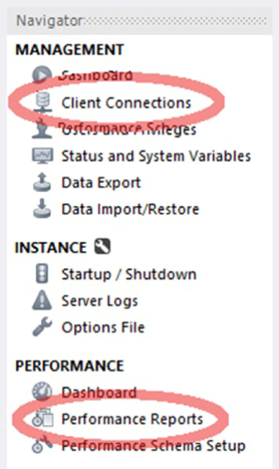

本节的其余部分将更详细地讨论这两种类型的报告。

### 绩效报告

工作台中的性能报告是调查实例中发生的情况的一个很好的方法。由于性能报告基于视图，因此可用的信息与在浏览 sys 架构视图相同。

通过连接到要调查的实例，从导航器的选择性能报告获取性能报告。您可以访问大多数报告，这些报表也可以直接使用进行。图显示了如何选择感兴趣的报表。

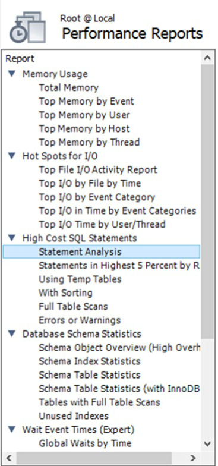

图显示了报表的示例，其中语句统计信息报告已执行。 这是使用"使用"视图"的报表。在本书的 GitHub 存储库中，可以在文件中看到包含所有列的报表示例。

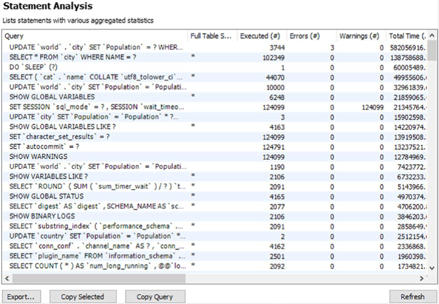

性能报告它们使用未格式化的视图定义，因此您可以使用 GUI 更改顺序。通过单击要排序的列的列标题来更改顺序。每次单击列标题时，顺序在升序和降序之间切换。

在报表底部，有按钮可帮助您使用报表。"按钮允许您将报表的结果另存为 CSV 文件。""按钮以 CSV 格式将标题和所选行复制到内存中。""按钮复制用于报表的查询。这允许您编辑查询并手动执行它。对于图，返回的查询选择 "从最后一个按钮的"刷新"按钮，该按钮将再次执行报表。

没有基于报告。相反，您需要使用客户端连接报告。

### 客户端连接报告

如果要获取当前连接到的列表，则需要使用客户端连接报告。它包含的信息量与多，但它包含最基本的数据。报告基于性能架构线程表，此外，如果可能，还包括程序名称。

图显示了报表最左侧列的示例。若要查看列的完整列表，请在figure_19_4_client_connections GitHub查看文件。

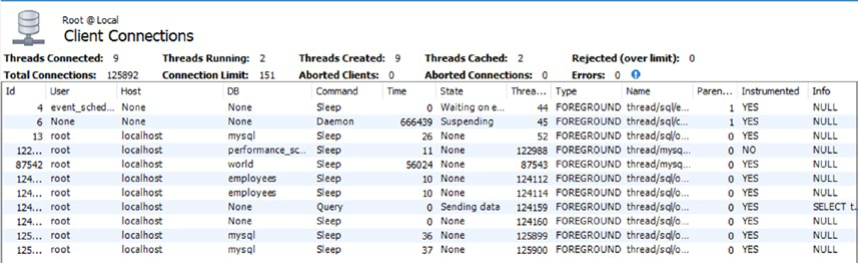

如果已打开客户端连接报告或其中一个性能报告，可以重用该连接来获取客户端连接报告。如果所有连接都已使用，并且您需要获取连接正在执行哪些功能的报告，这非常有用。客户端连接报告还允许您通过选择查询并使用报表右下部一个终止按钮来终止查询或连接。

虽然 MySQL 工作台对于调查性能问题非常有用，但它主要针对的是临时调查。要进行适当的监控，您需要一个完整的监控解决方案。

## MySQL 企业监视器

当您需要调查性能问题时，无论您是对用户投诉做出反应，还是主动寻求改进，都无法真正取代功能齐全的监控解决方案。本节将基于 MySQL 企业监视器 （MEM） 进行的讨论。其他监控解决方案可能提供类似的功能。

本节将讨论三个功能。第一个是查询分析器，然后是时间序列图，最后是临时报告，如进程和锁定等待报告。调查问题时，应结合使用各种指标。例如，如果您有高磁盘 I/O 使用情况的报告，则找到显示磁盘 I/O 的时间序列图，并确定 I/O 的开发时间和时间。然后，您可以使用查询分析器调查在此期间执行的查询。如果问题仍在进行中，可以使用流程报告或其他临时报告之一来查看正在执行的报表。

### 查询分析器

企业监视器中的查询分析器是需要调查性能问题时需要查看的重要位置之一。MySQL 企业监视器架构中的"模型"表定期收集已执行的查询。然后，它比较连续输出以确定自上一次数据收集以来的统计信息。这与在架构中使用语句性能分析器的示例中看到的情况类似，只是这是自动发生的，并且与收集的其他数据一起集成。

通过选择左侧菜单中的"，您可以访问查询分析器，如图。

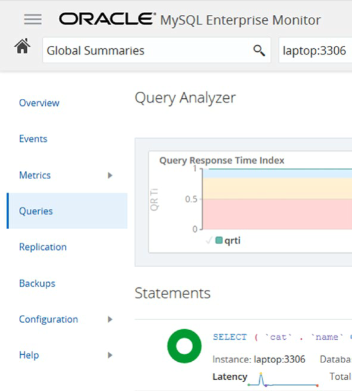

打开查询分析，默认打开查询响应时间索引 （QRTi） 图表的顶部和下面的查询列表。默认时间范围是过去一小时。您可以选择显示另一个图形或更改图形数。具有查询响应时间索引的默认图形值得考虑。

查询响应时间索引是单个查询或一组查询执行的量度。它使用 Apdex（应用程序性能指数）公式计算。由两个同心圆（圆环形）组成的查询信息旁边的形状根据查询在颜色绿色、黄色和红色中的表现情况进行着色，指示查询根据最佳、可接受和不可接受的条件执行的时间百分比：

- 当查询执行的时间比阈值设置为定义最佳性能的时间要少时。默认阈值为 100 ms。可以配置阈值。绿色用于最佳时间范围。
- 当查询执行的时间超过最佳时间帧的阈值，但低于阈值的四倍时。此框架使用黄色。
- 当查询慢于最佳阈值阈值的四倍时。此框架使用红色。

查询响应时间索引不是衡量实例性能的完美度量，但对于预期各种查询的响应时间大致相同的系统，它确实很好地指示了系统或查询在不同时间的性能。如果混合了非常快的 OLTP 查询和慢速 OLAP 查询，则性能的度量不是很好。

如果在图表中发现一些有趣的东西，可以选择该时间段，并使用它作为筛选查询的新时间范围。图形右上角视图"按钮，可用于设置图形和查询的时间范围、要显示的图形、查询的筛选器等。

查询列表是查看实际查询所需的操作。图。

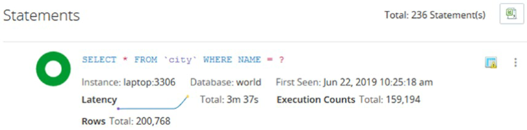

该信息是高级别的，旨在帮助您缩小在给定期间内要仔细查看的候选查询范围。在该示例中，您可以看到查询已执行了近 160，000 次，以便按名称查找城市。您应该问的第一个问题是，执行此查询的时间是否合理。这可能是预料之中的，但高执行计数也可能表示跑道进程不断执行同一查询，或者您需要实现查询缓存。您还可以从绿色甜甜圈中看到，与查询响应时间索引有关，所有执行都在最佳时间范围内。

查询区域右上角的图标（个垂直点的左侧）显示 MySQL 企业监视器已标记此查询。要获取图标的含义，请将鼠标悬停在图标上。此示例中的图标表示查询正在执行完整的表扫描。因此，即使查询响应时间索引看起来适合查询，也值得仔细查看查询。完成完整表扫描是否可接受取决于多个因素，例如表中的行数和执行查询的频繁程度。您还可以看到，查询延迟图显示图表右端的延迟增加，表明性能正在下降。

如果要更详细地调查查询，请单击查询区域右上角的三个垂直点，该点允许您转到查询的详细信息屏幕。图显示了查询详细信息的示例。全尺寸屏幕截图可在来自该书文件中提供。

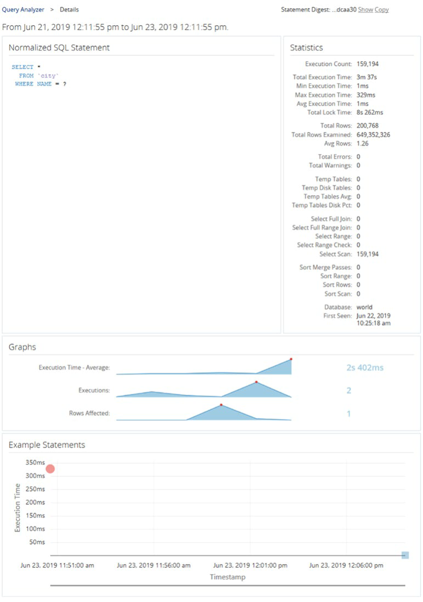

详细信息包括从性能架构摘要中可获得的指标。在这里，您可以看到，检查的行确实比返回的要多，因此值得进一步调查是否需要索引。这些图表显示了查询执行在一段时间中的发展。

底部是实际查询执行延迟的示例。在这种情况下，包括两个执行。第一个是图形左侧的红色圆圈。第二个是右下部蓝绿色标记。颜色表示每次执行的查询响应时间索引。此图仅在启用了使用者时才可用。

查询分析器非常适合调查查询，但要获得活动的更高级别摘要，您需要使用时间序列图。

### 时间序列图

是谈论监控系统时经常想到的。它们对于了解系统的总体负载并发现随时间的变化非常重要。但是，它们通常不太善于找到问题的根本原因。为此，您需要分析查询或生成临时报告以查看问题发生。

当你查看时间序列图时，您需要考虑一些事情;否则，您可能会得出错误的结论，并在没有问题时宣布紧急状况。首先，您需要了解图表中的指标的含义，如 I/O 延迟含义章节前面讨论的问题。其次，请记住，指标的变化本身并不意味着存在问题。它只是意味着活动发生了改变。如果开始执行更多查询，因为进入一天或一年的高峰期，则数据库活动自然会增加，反之亦然， 当您进入一个安静的时间段时。同样，如果实现一项新功能（如向应用程序的开始屏幕添加元素），则预计这也会增加执行的量。第三，注意不要只考虑单个图形。如果您不考虑其他数据而查看监视数据，则很容易得出错误的结论。

如果查看图则有一个示例，其中几个时间序列图用于数据库和系统的利用率变化的时间段。

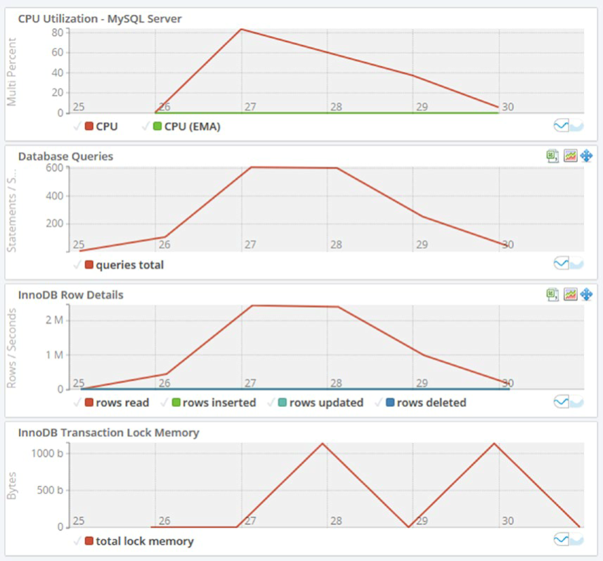

如果查看图表最顶层图形中的 CPU 利用率突然增加，峰值超过 80%。为什么会这样， 这是件坏事吗？数据库查询图显示，秒数增加，InnoDB 行详细信息图中读取的行数也会增加。因此，CPU 使用率很可能是由查询活动增加引起的。从那里，您可以转到查询分析器并调查哪些查询正在运行。

可以从图形中拿走几个其他点。如果查看 x 轴，则图表仅包含 6 分钟的数据。注意不要根据很短的时间框架得出结论，因为这可能不代表系统的真实状态。另一件事是记住查看数据的规模。是的，CPU 使用率和 InnoDB 事务锁内存突然增加，但它发生在 0 的基数上。系统有多少个 CPU？如果您有 96 个 CPU，那么使用 80% 的 CPU 真的没什么，但如果您在单个 CPU 虚拟机上，则占用空间较小。对于事务锁定内存，如果将 y 轴考虑在内，则可以看到"尖峰"只是 1 KiB 的锁内存，因此不用担心。

有时，您需要调查持续的问题，在这种情况下，时间序列图和查询分析器可能无法为您提供所需的信息。在这种情况下，您需要临时报告。

### 特别报告

MySQL 企业监视器中提供多个临时报告。其他监视解决方案可能有类似的或其他报告。这些报告与本章前面讨论的架构报告中提供的信息类似。通过监视解决方案访问临时报表的一个优点是，如果应用程序已连接，您可以重用连接，并且它提供了一个图形用户界面来操作报表。

这些报告包括获取进程列表、锁定信息、架构统计信息等的能力。每个视图等效于一个视图。在编写本报告时，存在以下报告：

- 此报告显示每个表的使用量取决于总延迟、提取的行、更新的行等。它等效。
- 此报告显示每个用户名的活动。它等效于视图。
- 此报告显示每个内存类型的内存使用量。它等效于视图。
- 此报告显示磁盘 I/O 使用情况。报表有三个选项：按文件分组（相当于 io_global_by_file_by_latency 视图），等效于 io_global_by_wait_by_latency 视图的等待 （I/O）线程视图）。按等待类型分组添加与 I/O 相关的时间序列图。
- 此报告显示 InnoDB 缓冲池中存储的数据。它基于信息表。由于查询此报表的信息时可能会有大量开销，因此建议仅在测试系统上使用报表。
- 此MySQL 中当前存在的前景和后台线程。它使用 ，只不过它还包括后台线程。
- 此报告有两个选项。您可以获取 InnoDB 锁等待（视图视图）锁（视图）报表。

使用报告的原则是相同的，因此仅显示两个示例。第一个位于，其中 InnoDB 锁等待情况显示在锁等待报告中。

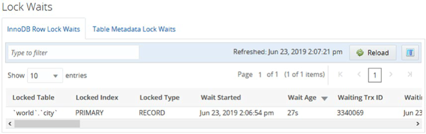

该报表以分页模式显示行，您可以通过单击列标题更改顺序。更改顺序不会重新加载数据。如果需要重新加载数据，请使用的"重新加载"按钮。

您还可以操作报表中可用的列。在右上角，有一个按钮来选择要在报表中可见的列。图中的屏幕截图显示了如何选择要显示的列的示例。

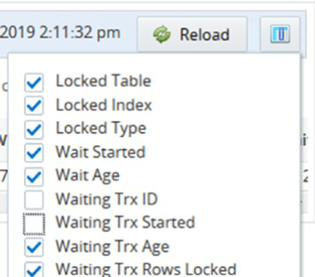

当您切换是否包含列时，报表将立即更新，而不会重新加载报表。这意味着，对于间歇性问题（如锁定等待），您可以操作报表，而不会丢失正在查看的数据。如果通过拖动列标题来更改列的顺序，则情况也相同。

其中一报表可以选择基于标准列的输出和树状图视图。对于 InnoDB 缓冲池报表，树状图视图是唯一支持的格式。树状图输出使用基于该值的面积的矩形，因此，如果矩形的面积是另一个矩形的两倍，则意味着该值是该值的两倍大。这可以帮助可视化数据。

图显示了数据库中表的总插入延迟的树图视图示例。在此示例中，只有三个表具有足够大的分数，占总插入延迟的分数，以绘制矩形。

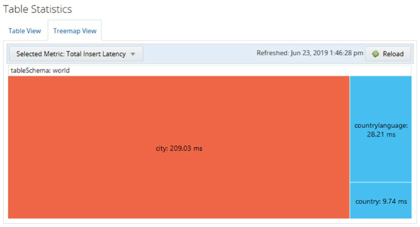

查看树状图，可以立即看到将数据插入城市表中所花费的时间比其他表大得多。

临时查询都处理执行报表时的状态。另一方面，查询分析器和时间序列图与过去发生的情况一起使用。显示过去发生的情况的另一个工具是缓慢的查询日志。

## 慢速查询日志

慢是一个值得信赖的旧工具，用于查找性能不佳的查询并调查 MySQL 中过去的问题。在性能架构具有许多选项来查询速度较慢、不使用索引或满足其他条件的语句时，性能架构在今天似乎没有必要。但是，慢速查询日志有一个主要优势，即保留它，因此即使在 MySQL 重新启动后，您也可以返回并使用它。

有两种基本类型的模式可以使用慢速查询日志。如果您知道何时发生问题，可以检查日志中是否当时查询速度较慢。一种情况是，查询由于锁定问题而堆积如山，您知道问题何时结束。然后，您可以在日志中找到该时间，并查找第一个查询，该查询已完成足够长的时间，可成为堆积问题的一部分;该查询可能是导致堆积可能与一些其他查询在该时间点左右或之后完成有关。

另一种使用模式是使用实用程序创建慢速查询的聚合。这将规范化类似于性能架构的查询，因此类似的查询将聚合其统计信息。此模式非常适合查找可能导致系统忙碌的查询。

您可以使用 -s 选项选择要对聚合查询可以使用总计数排序值）查找执行次数最多的查询。执行查询的频繁进行，优化查询的好处也越大。您可以以类似的方式使用总执行时间 （） 。如果用户抱怨响应时间过慢，则平均执行时间 （） 可用于排序.如果您怀疑某些查询返回的行太多，因为它们缺少筛选器条件，可以根据查询返回的行数（对查询进行排序。通常，将排序选项与选项合并以反转顺序包含前 N 个查询非常有用。这样，就更容易专注于产生最大影响的查询。

您还需要记住，默认情况下，日志不会记录所有查询，因此您不会像性能架构那样了解工作负载。您需要通过更改配置选项来调整考虑查询速度阈值。可以更改会话的选项，因此，如果预期执行时间存在显著变化，可以设置全局值以匹配大多数查询，并更改每个会话的连接执行查询的查询偏离正常。如果需要调查涉及 DDL 语句的问题，则需要确保启用"log_slow_admin_statements

分析报表的方式与性能架构，因此，读者将用作练习，以便从系统生成报告，并使用它们查找候选查询以进行进一步优化。

## 总结

本章探讨了可用于查找要优化的候选查询的可用源。还讨论了如何查找资源利用率，这些资源利用率可用于了解在哪些时间存在工作负载将系统推向其极限。当时运行的查询是最重要的焦点，但您应该对一般执行更多工作的查询睁大一点。

讨论开始通过性能架构，并考虑了哪些信息可用以及如何使用它。特别是是一个金矿，当寻找可能有性能问题的查询。但是，您不应只查看查询。您还应考虑表和文件 I/O 以及查询是否导致错误。这些错误可能包括锁定等待超时和死锁。

架构提供一系列现成的报表，可用于查找信息。这些报告基于性能架构，但它们包括筛选器、排序和格式，使报表易于使用，尤其是在调查问题时作为临时报表。还展示了如何使用语句性能分析器创建在感兴趣的期间运行的查询的报告。

MySQL 工作台提供基于的性能报告，以及基于性能架构的客户端连接报告。这些功能允许您通过图形用户界面进行临时报表，从而轻松更改数据的顺序并导航报表。

监视是可用于维护系统良好运行状况和调查性能问题的重要工具之一。MySQL 企业监视器用作监视讨论的基础。特别是查询分析器功能对于确定哪些查询对系统影响最大非常有用，但它应与时间序列图结合使用，以了解系统的整体状态。您还可以创建可用于调查当前问题的临时查询。

最后，您不应忘记与性能架构语句表具有优势的慢速查询日志，该日志保留慢速查询的录制。这样可以调查重新启动之前发生的问题。慢速查询日志还记录查询完成的时间，当用户报告系统在某些时候速度较慢时，这非常有用。

找到要进一步调查的查询后，该怎么办？第一步是分析它，下一章将讨论它。
